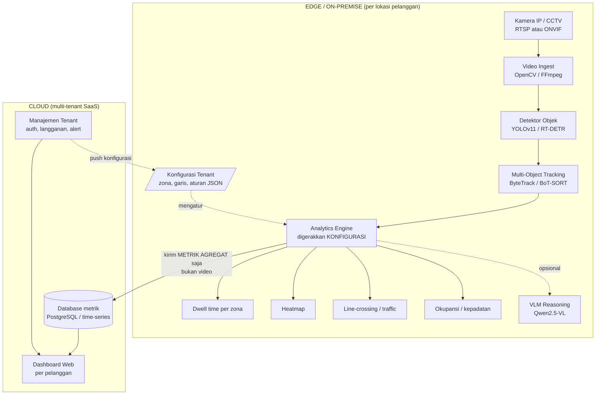

# Proof-of-Concept: Platform SaaS Analitik Video Cerdas Berbasis Multi-Object Tracking

> Dokumen POC + kerangka proposal Tugas Akhir — Teknik Komputer
> Konsep: **platform analitik video yang dapat dikonfigurasi (multi-tenant)** untuk berbagai sektor bisnis — F&B, ritel, klinik, gym, showroom, dsb.
> Tanggal: 2026-09-04

---

## 1. Ringkasan (Abstract Sementara)

Sistem CCTV konvensional bersifat **pasif** — hanya merekam dan menyimpan. Proyek ini membangun **platform SaaS analitik video** yang menambahkan **lapisan kecerdasan** di atas aliran video (RTSP). Inti sistem sama untuk semua pelanggan, sementara **zona, aturan, dan metrik dapat dikonfigurasi per pelanggan** (multi-tenant) sehingga cocok untuk **jenis bisnis apa pun**. Kemampuan dasar:

- mendeteksi & melacak setiap orang secara individual (Multi-Object Tracking / MOT),
- mengukur **lama tinggal (dwell time)** per zona ("1 hour 15 min", "2 min", dst.),
- menghasilkan **heatmap** area paling ramai,
- menghitung **traffic** (masuk/keluar, jam sibuk, kepadatan/okupansi),
- **line-crossing** & alur pergerakan antar-zona,
- **konfigurasi zona & aturan lewat dashboard** — tanpa mengubah kode.

Arsitektur bersifat **hybrid**: pemrosesan video (inferensi AI) berjalan di **edge/on-premise** milik pelanggan (hemat bandwidth, privasi terjaga — video tidak keluar), sedangkan **metrik agregat** dikirim ke **backend cloud** untuk dashboard, pelaporan, dan manajemen langganan.

### Template per vertikal (contoh, dapat ditambah)

| Sektor | Metrik utama yang dikonfigurasi |
|---|---|
| **F&B / Kafe** | Dwell time meja, okupansi, antrean kasir, jam sibuk |
| **Ritel / Toko** | Traffic pintu, zona populer (heatmap rak), konversi masuk→kasir |
| **Klinik / Layanan** | Panjang & waktu tunggu antrean, okupansi ruang tunggu |
| **Gym / Fasilitas** | Okupansi area/alat, jam padat |
| **Showroom / Galeri** | Zona menarik perhatian, durasi kunjungan per area |

> Barista/staf hanya salah satu contoh template ("zona kerja + okupansi"), bukan fokus tunggal — sengaja dibuat generik agar bisa dijual ke banyak segmen.

---

## 2. Video Referensi

Video-video di bawah menjadi acuan visual keluaran sistem yang ditargetkan.

### Video Referensi 1
[](https://www.youtube.com/watch?v=dHcxTmU6atk)

▶️ <https://www.youtube.com/watch?v=dHcxTmU6atk>

### Video Referensi 2
[](https://www.youtube.com/watch?v=sFc1ZhDjvYI)

▶️ <https://www.youtube.com/watch?v=sFc1ZhDjvYI>

### Video Referensi 3
[](https://www.youtube.com/watch?v=ng1onQ42seE)

▶️ <https://www.youtube.com/watch?v=ng1onQ42seE>

### Video Referensi 4
[](https://www.youtube.com/watch?v=i_mL3LT0lDg)

▶️ <https://www.youtube.com/watch?v=i_mL3LT0lDg>

### Video Referensi 5
[](https://www.youtube.com/watch?v=E01h7ljKtpk)

▶️ <https://www.youtube.com/watch?v=E01h7ljKtpk>

### Video Refrensi 6
[](https://www.youtube.com/watch?v=zBao3QunnGY)

▶️ <https://www.youtube.com/watch?v=zBao3QunnGY>

> Catatan: di file `.md`, YouTube tidak bisa diputar langsung — thumbnail di atas dapat diklik untuk membuka video. Untuk versi yang **benar-benar bisa diputar (embedded)**, gunakan blok HTML `<iframe>` di bawah (akan aktif jika dokumen dirender ke HTML, mis. lewat MkDocs / Docusaurus / GitHub Pages):

```html
<iframe width="560" height="315"
  src="https://www.youtube.com/embed/dHcxTmU6atk"
  title="Video Referensi 1" frameborder="0" allowfullscreen></iframe>

<iframe width="560" height="315"
  src="https://www.youtube.com/embed/sFc1ZhDjvYI"
  title="Video Referensi 2" frameborder="0" allowfullscreen></iframe>

<iframe width="560" height="315"
  src="https://www.youtube.com/embed/ng1onQ42seE"
  title="Video Referensi 3" frameborder="0" allowfullscreen></iframe>

<iframe width="560" height="315"
  src="https://www.youtube.com/embed/i_mL3LT0lDg"
  title="Video Referensi 4" frameborder="0" allowfullscreen></iframe>

<iframe width="560" height="315"
  src="https://www.youtube.com/embed/E01h7ljKtpk"
  title="Video Referensi 5" frameborder="0" allowfullscreen></iframe>
```

---

## 3. Latar Belakang

- Pelaku usaha lintas sektor (F&B, ritel, layanan, kebugaran) membutuhkan data objektif tentang **perilaku pengunjung** dan **efisiensi operasional**, tetapi mayoritas hanya punya CCTV pasif.
- Solusi analitik video komersial yang ada umumnya **mahal, tertutup (proprietary), dan kaku** — sulit disesuaikan untuk kebutuhan tiap jenis usaha. Ada peluang membangun **platform SaaS yang dapat dikonfigurasi** dan terjangkau.
- Kamera IP konsumer (mis. EZVIZ, TP-Link) sering **mengunci akses stream lokal** (RTSP tertutup, hanya cloud) — sehingga sulit diolah. Ini menjadi tantangan integrasi tersendiri yang layak diangkat secara akademis dan menjadi **nilai jual** (mendukung kamera murah yang sudah dimiliki pelanggan).
- Kemajuan **deep learning** (YOLO, Transformer detector) membuat analitik video real-time bisa berjalan di PC/edge device berbiaya wajar — memungkinkan model bisnis **edge + cloud** yang hemat.

---

## 4. Rumusan Masalah

1. Bagaimana merancang pipeline yang mengubah aliran RTSP CCTV menjadi **data analitik terstruktur** (traffic, dwell time, heatmap) secara real-time?
2. Bagaimana **Multi-Object Tracking** dapat mengukur lama tinggal dan pergerakan individu secara akurat pada kondisi ramai & saling menghalangi (*occlusion*)?
3. Bagaimana merancang platform agar **zona dan aturan analitik dapat dikonfigurasi per pelanggan (multi-tenant)** tanpa mengubah kode, sehingga satu sistem melayani banyak jenis bisnis?
4. Seberapa akurat sistem dibanding pengamatan manual, dan berapa **throughput (FPS)** yang dicapai pada perangkat kelas menengah?

---

## 5. Tujuan & Batasan

**Tujuan**
- Membangun **inti platform** (analytics engine) yang menerima RTSP → deteksi → tracking → analitik → visualisasi.
- Membuat mekanisme **konfigurasi zona & aturan** (mis. via file JSON / UI) agar sistem dapat diadaptasi ke berbagai bisnis tanpa ubah kode.
- Menyediakan **dashboard** metrik (dwell time, heatmap, traffic) dengan konsep **multi-tenant**.

**Batasan (Scope Tugas Akhir)**
- Prototipe inti + **2–3 template vertikal** sebagai bukti kegenerikan (mis. kafe & ritel).
- Skala uji: 1 kamera indoor per tenant (arsitektur menyiapkan multi-kamera/multi-tenant, implementasi penuh = pengembangan lanjutan).
- Objek utama: **person** (dapat ditambah: kursi, meja, gelas, troli, dsb.).
- Evaluasi pada rekaman/video sampel + uji lapangan terbatas.
- **Tanpa** identifikasi wajah/nama pada tahap awal (alasan privasi — lihat §11).
- Fitur komersial SaaS (billing, autentikasi multi-tenant penuh) dirancang secara arsitektur, namun implementasi produksi di luar cakupan tugas akhir.

---

## 6. Arsitektur Sistem

Arsitektur **hybrid edge–cloud** dengan inti generik + konfigurasi per tenant:



**Prinsip kunci:** yang dikirim ke cloud hanya **metrik/angka**, bukan video — menjaga privasi, hemat bandwidth, dan skalabel. Perbedaan antar-jenis bisnis **seluruhnya** ditentukan oleh **berkas konfigurasi tenant** (zona, garis, aturan, target objek), bukan oleh perubahan kode.

---

## 7. Pemilihan Teknologi (State of the Art 2026)

| Komponen | Pilihan utama | Alternatif | Alasan |
|---|---|---|---|
| **Detektor** | YOLOv11 (Ultralytics) | YOLOv12, RT-DETR v2/v3 | Cepat, akurat, ekosistem matang; RT-DETR unggul di scene padat |
| **Tracker** | ByteTrack | BoT-SORT, Deep OC-SORT | Ringan, ID stabil, tahan occlusion ringan |
| **Re-ID** | OSNet | TransReID | Menjaga ID saat orang keluar-masuk frame / lintas kamera |
| **Analitik zona** | Supervision (Roboflow) | custom | Ada tools jadi: PolygonZone, line counter, time-in-zone, heatmap |
| **Reasoning (opsional)** | Qwen2.5-VL / InternVL | GPT-4o-class | Deskripsi adegan level tinggi ("meja kosong, gelas kotor") |
| **Video I/O** | OpenCV + FFmpeg | GStreamer | Baca RTSP, decoding |
| **Agen edge** | Python + PyQt6 (desktop) | Electron, service | Berjalan di lokasi pelanggan, olah video lokal |
| **Backend SaaS** | FastAPI + PostgreSQL | Django, Supabase | API multi-tenant, simpan metrik agregat |
| **Dashboard web** | React / Next.js | Streamlit (POC cepat) | Antarmuka pelanggan, grafik & laporan |
| **Time-series** | TimescaleDB / InfluxDB | — | Metrik dwell/traffic per waktu |
| **Konfigurasi tenant** | JSON schema + editor zona | — | Definisi zona/aturan tanpa ubah kode |

**Apakah YOLO cukup?** Ya, untuk deteksi + tracking + dwell + heatmap + counting, YOLO + ByteTrack sudah ideal. VLM hanya ditambahkan bila butuh *reasoning* fleksibel. Mulailah dari YOLO; VLM sebagai pengembangan lanjutan (nilai plus tugas akhir).

---

## 8. Proof of Concept (Kode)

### 8.1 Instalasi

```bash
python -m venv venv
# Windows
venv\Scripts\activate
pip install ultralytics supervision opencv-python numpy
```

Model YOLOv11 akan terunduh otomatis saat pertama dijalankan (`yolo11n.pt` = ringan, `yolo11m.pt` = lebih akurat).

### 8.2 Skrip inti — deteksi + tracking + dwell time per zona + heatmap

Simpan sebagai `poc_analitik.py`:

```python
"""
POC Analitik CCTV — YOLOv11 + ByteTrack + Supervision
Fitur: deteksi orang, tracking ID, dwell time per zona, heatmap.
Sumber: file video ATAU RTSP.
"""
import cv2
import numpy as np
from collections import defaultdict
from ultralytics import YOLO
import supervision as sv

# ---- Konfigurasi ----
SOURCE = "sample.mp4"            # ganti ke "rtsp://user:pass@ip:554/..." untuk live
MODEL_PATH = "yolo11n.pt"        # yolo11m.pt untuk akurasi lebih tinggi
PERSON_CLASS_ID = 0              # kelas "person" pada COCO

# Definisikan zona (poligon) — sesuaikan koordinat dengan frame kameramu.
# Contoh: satu area "meja pelanggan".
ZONA_MEJA = np.array([[100, 200], [500, 200], [500, 550], [100, 550]])

def main():
    model = YOLO(MODEL_PATH)
    tracker = sv.ByteTrack()

    cap = cv2.VideoCapture(SOURCE)
    fps = cap.get(cv2.CAP_PROP_FPS) or 25.0
    w = int(cap.get(cv2.CAP_PROP_FRAME_WIDTH))
    h = int(cap.get(cv2.CAP_PROP_FRAME_HEIGHT))

    zone = sv.PolygonZone(polygon=ZONA_MEJA)
    zone_annotator = sv.PolygonZoneAnnotator(zone=zone, color=sv.Color.RED)
    box_annotator = sv.BoxAnnotator()
    label_annotator = sv.LabelAnnotator()

    # Akumulator dwell time: tracker_id -> jumlah frame di dalam zona
    frames_in_zone = defaultdict(int)
    # Akumulator heatmap
    heatmap = np.zeros((h, w), dtype=np.float32)

    while True:
        ok, frame = cap.read()
        if not ok:
            break

        # Deteksi
        result = model(frame, verbose=False)[0]
        det = sv.Detections.from_ultralytics(result)
        det = det[det.class_id == PERSON_CLASS_ID]   # hanya orang

        # Tracking (memberi tracker_id stabil)
        det = tracker.update_with_detections(det)

        # Cek siapa yang berada di dalam zona
        mask_in_zone = zone.trigger(det)

        labels = []
        for i in range(len(det)):
            tid = det.tracker_id[i]
            if mask_in_zone[i]:
                frames_in_zone[tid] += 1
            detik = frames_in_zone[tid] / fps
            menit, dtk = divmod(int(detik), 60)
            jam, menit = divmod(menit, 60)
            if jam:
                waktu = f"{jam}h {menit}m"
            elif menit:
                waktu = f"{menit}m {dtk}s"
            else:
                waktu = f"{dtk}s"
            labels.append(f"ID {tid} | {waktu}")

            # Update heatmap di titik kaki (bawah-tengah bbox)
            x1, y1, x2, y2 = det.xyxy[i].astype(int)
            cx, cy = (x1 + x2) // 2, y2
            if 0 <= cy < h and 0 <= cx < w:
                cv2.circle(heatmap, (cx, cy), 25, 1.0, -1)

        # Visualisasi
        frame = box_annotator.annotate(frame, det)
        frame = label_annotator.annotate(frame, det, labels=labels)
        frame = zone_annotator.annotate(frame)

        cv2.imshow("POC Analitik CCTV", frame)
        if cv2.waitKey(1) & 0xFF == ord("q"):
            break

    # Simpan heatmap akhir
    hm = cv2.normalize(heatmap, None, 0, 255, cv2.NORM_MINMAX).astype(np.uint8)
    hm_color = cv2.applyColorMap(hm, cv2.COLORMAP_JET)
    cv2.imwrite("heatmap.png", hm_color)
    print("Heatmap disimpan -> heatmap.png")

    cap.release()
    cv2.destroyAllWindows()

if __name__ == "__main__":
    main()
```

### 8.3 Menjalankan

```bash
# dari file video
python poc_analitik.py
# untuk live, ubah SOURCE menjadi URL RTSP kamera (mis. Reolink/Hikvision/Dahua)
```

**Yang Anda dapatkan:** kotak per orang + ID + label lama tinggal (persis "1 hour 15 min" di gambar referensi), poligon zona, dan `heatmap.png`.

### 8.4 Konfigurasi per tenant (kunci ke-generican SaaS)

Semua zona/aturan didefinisikan di **berkas konfigurasi**, sehingga bisnis apa pun cukup ganti file ini — tanpa menyentuh kode. Contoh `tenant_kafe.json`:

```json
{
  "tenant_id": "kafe-001",
  "vertical": "fnb",
  "target_classes": ["person"],
  "zones": [
    { "name": "Meja Pelanggan", "type": "dwell", "polygon": [[100,200],[500,200],[500,550],[100,550]] },
    { "name": "Area Kasir",     "type": "occupancy", "polygon": [[520,180],[700,180],[700,420],[520,420]] }
  ],
  "lines": [
    { "name": "Pintu Masuk", "type": "counting", "p1": [50,120], "p2": [300,120] }
  ]
}
```

Untuk ritel, cukup ganti nama & koordinat zona (mis. "Zona Rak Promo", "Antrean Kasir") — engine yang sama berjalan. Ini yang membuat platform **dijual ke banyak segmen**.

### 8.5 Pengembangan lanjut (roadmap fitur)

- **Line counter** (masuk vs keluar) → `sv.LineZone` untuk hitung traffic per jam.
- **Editor zona visual** di dashboard (klik-tarik poligon di atas snapshot kamera) → hasilkan JSON otomatis.
- **Multi-zona & multi-kamera** → analisis alur antar-area.
- **Backend multi-tenant** (FastAPI) + **dashboard web** (grafik jam sibuk, rata-rata dwell, ekspor laporan).
- **Sistem alert** (mis. antrean > N orang, okupansi penuh) via notifikasi.
- **VLM** untuk event kompleks (opsional, fitur premium).

---

## 9. Metodologi

1. **Studi literatur** — MOT (SORT→ByteTrack→BoT-SORT), object detection (YOLO/RT-DETR).
2. **Pengumpulan data** — rekaman CCTV dari ≥2 jenis lokasi (mis. kafe & toko) + anotasi zona.
3. **Perancangan sistem** — arsitektur hybrid edge–cloud + skema konfigurasi tenant (§6).
4. **Implementasi** — analytics engine (§8) + skema konfigurasi + dashboard.
5. **Pengujian & evaluasi** — §10.
6. **Analisis & kesimpulan.**

---

## 10. Rencana Pengujian & Metrik

| Aspek | Metrik | Cara ukur |
|---|---|---|
| Akurasi deteksi | Precision, Recall, mAP | Bandingkan vs anotasi ground-truth |
| Akurasi tracking | MOTA, IDF1, ID switches | Tool `motmetrics` |
| Akurasi dwell time | Error (detik) | Bandingkan vs stopwatch manual pada sampel |
| Akurasi counting | % error masuk/keluar | Hitung manual vs sistem |
| Kinerja | FPS, latensi, penggunaan GPU/CPU | Profiling pada perangkat uji |
| **Kegenerikan (SaaS)** | Waktu & langkah adaptasi ke bisnis baru **tanpa ubah kode** | Terapkan ke ≥2 vertikal hanya dengan ganti berkas konfigurasi |
| **Skalabilitas** | Jumlah kamera/tenant per node, throughput backend | Uji beban bertingkat |

**Target contoh:** ≥ 20 FPS pada GPU kelas menengah (mis. RTX 3060), error dwell time < 10%, dan **adaptasi ke jenis bisnis baru cukup lewat konfigurasi (0 baris kode)**.

---

## 11. Aspek Etika & Privasi

- **UU PDP No. 27/2022** mengatur data pribadi termasuk biometrik. Pengenalan wajah/nama = data sensitif, butuh dasar hukum/consent.
- **Rekomendasi:** tahap awal cukup **analitik anonim** (hitung orang, dwell, heatmap **tanpa identitas**) — sudah memberi insight bisnis dan minim risiko hukum.
- Pasang pemberitahuan area terpantau; simpan hanya metrik agregat, bukan wajah.

---

## 12. Revisi Judul Tugas Akhir

Karena arah proyek kini adalah **platform SaaS generik** (bisa dikonfigurasi untuk bisnis apa pun), fokus "barista" dilepas dari judul dan hanya menjadi **salah satu template studi kasus**. Judul sebaiknya menekankan tiga kata kunci: **platform yang dapat dikonfigurasi**, **Multi-Object Tracking**, dan **integrasi RTSP**.

| # | Draft asli | Catatan | Usulan perbaikan |
|---|---|---|---|
| 1 | *Sistem Pemantauan Beban Kerja dan Mobilitas Barista Berbasis Multi-Object Tracking* | Terlalu sempit untuk visi SaaS — turunkan jadi salah satu template, bukan judul. | *(dipakai sebagai studi kasus, bukan judul utama)* |
| 2 | *Analisis Perilaku Konsumen pada Area Komersial berbasis teknologi Multi-Object Tracking Terintegrasi CCTV* | Tema bagus & generik, tapi belum menonjolkan sifat **platform/konfigurabel**. | **"Rancang Bangun Platform Analitik Perilaku Pengunjung Berbasis Multi-Object Tracking yang Dapat Dikonfigurasi untuk Berbagai Sektor Bisnis"** |
| 3 | *Aplikasi Desktop All-in-One untuk Analitik Video Cerdas Terintegrasi Protokol RTSP pada Consumer IP Camera* | **Paling kuat secara Teknik Komputer** (rekayasa sistem + integrasi protokol). Tinggal diangkat ke level "platform SaaS". | **"Rancang Bangun Platform SaaS Analitik Video Cerdas Berbasis Multi-Object Tracking dengan Integrasi Protokol RTSP pada Kamera IP Konsumer"** |

### Rekomendasi

Untuk **Teknik Komputer** dengan visi SaaS, gabungkan kekuatan **#3 (rekayasa sistem + RTSP)** dan **#2 (analitik generik lintas sektor)**:

**Judul utama yang disarankan:**

> **"Rancang Bangun Platform SaaS Analitik Video Cerdas Berbasis Multi-Object Tracking dengan Arsitektur Konfigurabel Multi-Tenant dan Integrasi Protokol RTSP pada Kamera IP Konsumer"**

Alternatif lebih ringkas (bila judul dibatasi panjangnya):

> **"Rancang Bangun Platform Analitik Video Multi-Tenant Berbasis Multi-Object Tracking dengan Integrasi RTSP untuk Berbagai Sektor Bisnis"**

**Mengapa ini kuat sebagai tugas akhir Teknik Komputer:**
- **Artefak rekayasa jelas** — platform + integrasi protokol RTSP (bukan sekadar skrip analitik).
- **Kontribusi arsitektural** — desain **multi-tenant & konfigurabel** (menjawab "bagaimana satu sistem melayani banyak bisnis").
- **Generik & bernilai jual** — bukti kegenerikan lewat ≥2 template vertikal; barista/kafe cukup jadi salah satu contoh di bab pengujian.

> Catatan: kata "SaaS" boleh dipertahankan bila pembimbing setuju; jika kampus lebih suka istilah teknis, ganti dengan **"Multi-Tenant"** yang bermakna sama secara arsitektur.

---

## 13. Dataset Publik

Untuk deteksi **"person"**, YOLO pretrained COCO sudah cukup — dataset di bawah terutama untuk **evaluasi/benchmark**, **fine-tuning** sudut kamera sulit, dan **crowd density**. Sebagian besar berlisensi **riset/non-komersial** — cek lisensi sebelum dipakai di produk SaaS.

### Other Dataset
Assembly101: A Large-Scale Multi-View Video Dataset for Understanding Procedural Activities: https://assembly-101.github.io/
OpenPack dataset: https://open-pack.github.io/

### Tracking orang (MOT) — untuk uji dwell time & stabilitas ID
| Dataset | Relevansi | Sumber |
|---|---|---|
| **MOT20** | Scene sangat padat (kerumunan) — paling mirip kafe/ritel ramai | <https://motchallenge.net/data/MOT20/> |
| **MOT17** | Benchmark standar tracking pejalan kaki | <https://motchallenge.net/data/MOT17/> |
| **DanceTrack** | Banyak objek mirip, gerak tak beraturan — uji ketahanan ID | <https://github.com/DanceTrack/DanceTrack> |
| **HiEve** | Human-centric events di CCTV (jatuh, berkerumun) | <http://humaninevents.org/> |

### Ritel / mal / indoor — paling dekat studi kasus
| Dataset | Isi | Sumber |
|---|---|---|
| **Mall Dataset (CUHK)** | CCTV dalam mal, anotasi untuk counting/kepadatan | <https://personal.ie.cuhk.edu.hk/~ccloy/downloads_mall_dataset.html> |
| **ATC Shopping Mall (ATR)** | Trajektori pengunjung mal berbulan-bulan — alur/behaviour | <https://irc.atr.jp/crest2010_HRI/ATC_dataset/> |
| **Edinburgh Informatics Forum** | Lintasan pejalan kaki indoor (footfall & dwell) | <https://homepages.inf.ed.ac.uk/rbf/FORUMTRACKING/> |
| **MERL Shopping** | Pembeli di rak toko + anotasi aksi | <https://www.merl.com/research/highlight/MERL-shopping-dataset> |
| **Oxford Town Centre** | Video padat, tracking + dwell (baseline populer) | Cari: "Oxford Town Centre dataset" |

### Deteksi orang di keramaian — untuk fine-tuning detektor
| Dataset | Isi | Sumber |
|---|---|---|
| **CrowdHuman** | Deteksi orang padat & occlusion berat | <https://www.crowdhuman.org/> |
| **COCO** | Basis pretrained YOLO (kelas "person") | <https://cocodataset.org/> |

### Crowd counting / okupansi zona
| Dataset | Sumber |
|---|---|
| **ShanghaiTech Part A/B** | <https://github.com/desenzhou/ShanghaiTechDataset> |
| **UCF-QNRF** | <https://www.crcv.ucf.edu/data/ucf-qnrf/> |
| **PETS2009** | <http://cs.binghamton.edu/~mrldata/pets2009> |

### Person Re-ID — jaga ID lintas kamera (fitur multi-kamera)
| Dataset | Catatan | Sumber |
|---|---|---|
| **Market-1501** | Standar re-ID | Cari: "Market-1501 dataset" |
| **MSMT17** | Skala besar, multi-kamera | Cari: "MSMT17 dataset" |
| ~~DukeMTMC-reID~~ | **Ditarik** karena isu privasi — hindari | — |

### Repositori siap-pakai (paling praktis)
- **Roboflow Universe** — <https://universe.roboflow.com/> (cari `cafe`, `retail people`, `CCTV person`, `overhead people`; banyak yang **langsung format YOLO**)
- **Kaggle Datasets** — <https://www.kaggle.com/datasets> (kata kunci serupa)

> **Strategi tugas akhir:** (1) deteksi/tracking pakai YOLO pretrained COCO tanpa training; (2) **metrik tracking (MOTA/IDF1)** dievaluasi di **MOT20/MOT17** (punya ID + bbox); **metrik counting/kepadatan** dievaluasi di **Mall Dataset** (anotasi titik kepala per frame, cocok untuk counting, bukan tracking); (3) bukti kegenerikan SaaS = rekam video sendiri di ≥2 lokasi (mis. kafe + minimarket), terapkan hanya dengan ganti konfigurasi. Lihat skrip evaluasi di `scripts/eval_tracking.py`.

---

## 14. Referensi (untuk dilengkapi)

- Ultralytics YOLOv11 — <https://docs.ultralytics.com>
- Supervision (Roboflow) — <https://supervision.roboflow.com>
- ByteTrack: *Zhang et al., 2022, "ByteTrack: Multi-Object Tracking by Associating Every Detection Box"*
- BoT-SORT: *Aharon et al., 2022*
- RT-DETR: *Zhao et al., 2023/2024*
- UU No. 27 Tahun 2022 tentang Pelindungan Data Pribadi

---

*Dokumen ini adalah proof-of-concept awal; kode §8 sudah dapat dijalankan sebagai fondasi dan dikembangkan sesuai fitur pada §8.4.*
