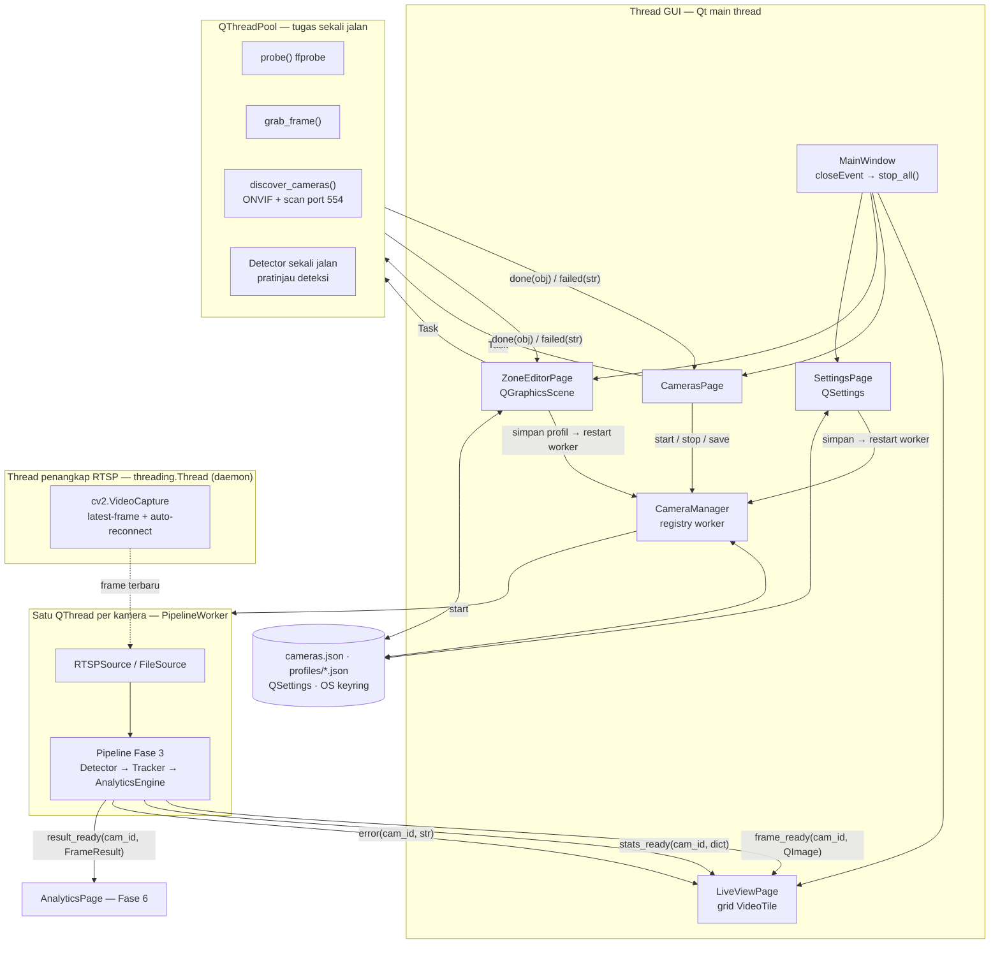
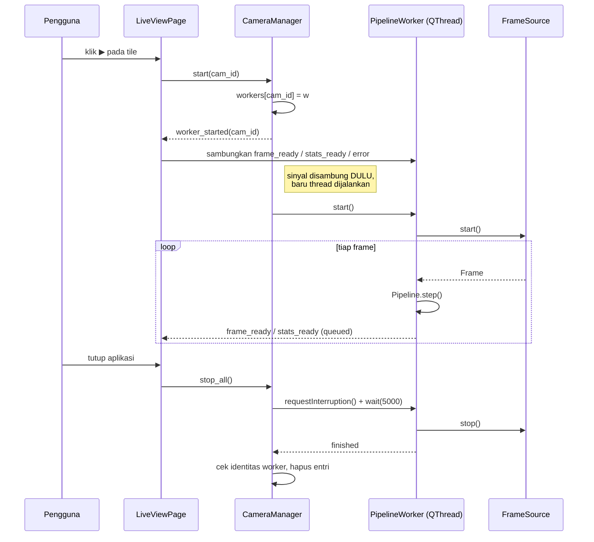

# Fase 5 — Arsitektur Thread Aplikasi Desktop

> Bahan Bab III. Sumber: implementasi `aio_cctv/gui/` ([FASE-05](../fase/FASE-05-aplikasi-desktop-pyqt6.md) §2).

Aturan yang dipegang seluruh aplikasi: **tidak ada pekerjaan berat di thread GUI**, dan
**thread pekerja tidak pernah menyentuh widget** — semua komunikasi lewat signal Qt, yang
secara otomatis menjadi *queued connection* saat melintasi thread.

## Titik rawan dan penanganannya

| Titik rawan | Penanganan |
|---|---|
| Konversi `QImage` tiap frame membebani thread GUI | Frame di-*emit* maks `display_fps` kali per detik (bawaan 15), terpisah dari laju inferensi |
| Kamera mati membuat thread diam tanpa kabar | Blok `stats_ready` berada **di luar** cabang "frame diterima", sehingga state `connecting`/`reconnecting` tetap terkirim tiap detik |
| `QThread.finished` tiba **tertunda** (queued) | `_on_worker_finished` membandingkan identitas worker sebelum mencoret entri; tanpa ini, restart cepat membuat worker baru hilang dari registry dan berjalan tanpa tercatat |
| Worker belum berhenti saat `wait(5000)` habis | Referensinya ditahan di `CameraManager._retired`; QThread yang di-GC selagi berjalan membuat proses `abort` |
| Sinyal worker tiba setelah tile dihapus | Penerima mencari tile lewat `cam_id`; tile yang tidak ada diabaikan |
| Item scene dihapus saat aplikasi ditutup, sinyal masih menembak | `sip.isdeleted()` menyaring item mati di `ZoneEditorPage` |
| Operasi jaringan membekukan dialog | Semua lewat `QThreadPool` (`net_tasks.run_async`); dialog menandai dirinya mati (`_alive`) agar tugas yang telat tidak menyentuh widget |

## Urutan mulai dan berhenti

