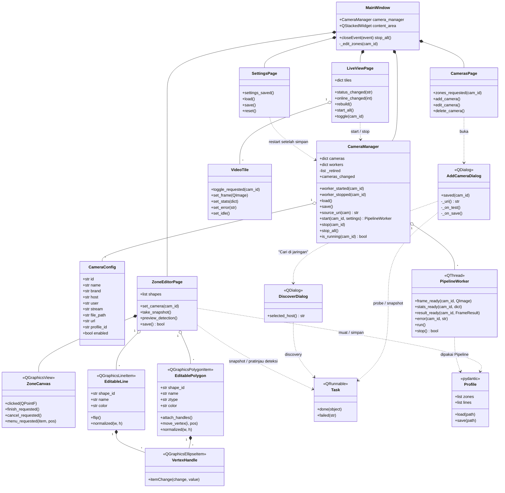

# Fase 5 — Class Diagram GUI

> Bahan Bab III. Sumber: implementasi `aio_cctv/gui/` ([FASE-05](../fase/FASE-05-aplikasi-desktop-pyqt6.md) §3).

Prinsip yang tergambar di bawah: **`CameraManager` tidak mengenal widget sama sekali.**
Halaman memanggil manager, dan menerima kabar balik hanya lewat signal. Karena itu editor
zona dan halaman Pengaturan bisa menjalankan ulang worker tanpa tahu apa pun soal
`LiveViewPage` — tile tetap tersambung karena Live View mendengarkan `worker_started`.

## Pemisahan berkas

| Lapisan | Berkas | Tidak boleh tahu soal |
|---|---|---|
| Data & proses | `core/paths.py`, `core/secrets.py`, `gui/camera_manager.py`, `gui/workers/` | widget apa pun |
| Tampilan | `gui/pages/`, `gui/widgets/`, `gui/dialogs/` | detail thread; hanya menyambung signal |
| Analitik | `aio_cctv/pipeline.py` dan turunannya (Fase 1–3) | Qt sama sekali |

`PipelineWorker` adalah satu-satunya titik temu antara Qt dan `Pipeline`; `Pipeline` sendiri
dipakai **tanpa perubahan** dari Fase 3.
