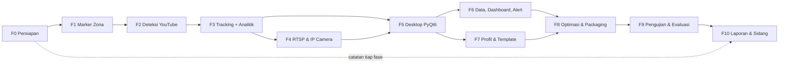
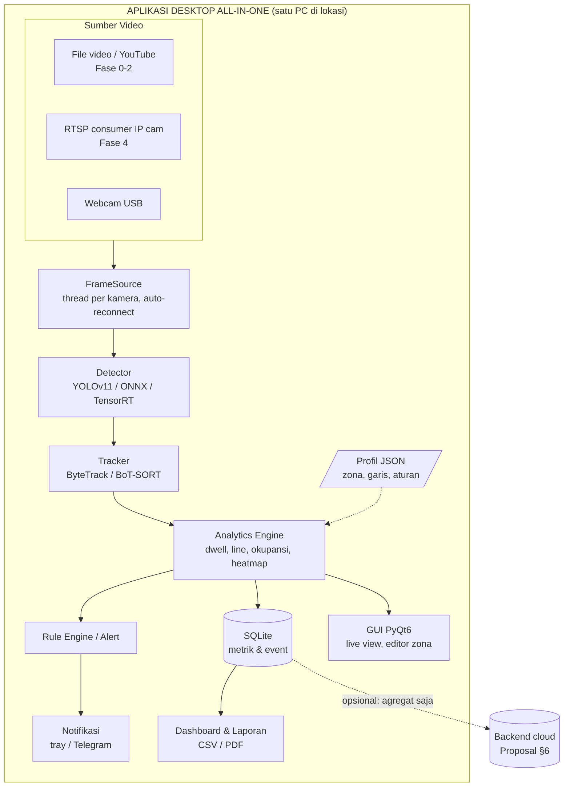

# Roadmap Development — Aplikasi Desktop All-in-One Analitik Video Cerdas (RTSP + Consumer IP Camera)

> Dokumen induk dari seluruh fase development.
> Referensi utama: [`PROPOSAL-POC-Analitik-CCTV.md`](../../PROPOSAL-POC-Analitik-CCTV.md) (selanjutnya disebut **Proposal**, bagian dirujuk dengan tanda **§**).
> Dibuat: 2026-09-19

---

## 1. Arah Proyek

| Aspek | Isi |
|---|---|
| **Target awal (MVP)** | Aplikasi yang bisa **menandai area (marker zona/garis) di atas video** dan melakukan **deteksi orang sederhana** pada video yang diambil dari **YouTube** (video referensi Proposal §2). |
| **Fokus akhir Tugas Akhir** | **Aplikasi desktop all-in-one untuk analitik video cerdas** yang terintegrasi **protokol RTSP** pada **consumer IP camera** (EZVIZ, TP-Link Tapo, Imou/Dahua, Hikvision, Reolink, kamera V380/iCSee/XMEye, dll). |
| **Inti teknis** | YOLOv11 (deteksi) → ByteTrack (Multi-Object Tracking) → Analytics Engine berbasis konfigurasi (dwell time, heatmap, line-crossing, okupansi) — Proposal §6, §7, §8. |
| **Posisi terhadap Proposal** | Proposal merekomendasikan platform SaaS *hybrid edge–cloud* (§6). Fokus akhir TA mengambil **sisi EDGE** dari arsitektur itu (“Agen edge: Python + PyQt6 desktop”, Proposal §7) dan menjadikannya produk utuh. Sisi cloud/multi-tenant tetap dirancang sebagai **ekstensi opsional** (Fase 7), sehingga visi §6 tidak hilang. |

### Usulan judul yang selaras dengan fokus akhir

Proposal §12 tabel baris #3 menyebut judul desktop sebagai *“paling kuat secara Teknik Komputer”*. Versi yang disarankan untuk fokus akhir ini:

> **“Rancang Bangun Aplikasi Desktop All-in-One Analitik Video Cerdas Berbasis Multi-Object Tracking dengan Integrasi Protokol RTSP pada Kamera IP Konsumer”**

Alternatif bila ingin tetap menonjolkan sifat konfigurabel (Proposal §12 “Rekomendasi”):

> *“… Berbasis Multi-Object Tracking dengan Profil Analitik Konfigurabel dan Integrasi Protokol RTSP pada Kamera IP Konsumer”*

---

## 2. Daftar Fase

| Fase | Dokumen | Tujuan singkat | Milestone | Estimasi |
|---|---|---|---|---|
| 0 | [FASE-00 — Persiapan Lingkungan & Struktur Proyek](FASE-00-persiapan-lingkungan.md) | Environment Python/GPU, struktur repo, unduh video YouTube referensi | — | 1 minggu |
| 1 | [FASE-01 — Marker Area (Editor Zona & Garis)](FASE-01-marker-area-zona.md) | Menggambar poligon zona & garis di atas frame video → simpan JSON | **M1** | 1–2 minggu |
| 2 | [FASE-02 — Deteksi Sederhana pada Video YouTube](FASE-02-deteksi-sederhana-video-youtube.md) | YOLOv11 deteksi orang + hitung orang per zona pada video YouTube | **M1 (MVP awal)** | 1–2 minggu |
| 3 | [FASE-03 — Tracking & Analytics Engine Inti](FASE-03-tracking-analitik-inti.md) | ByteTrack, dwell time, line-crossing, okupansi, heatmap; pipeline modular | **M2** | 3 minggu |
| 4 | [FASE-04 — Integrasi RTSP & Consumer IP Camera](FASE-04-integrasi-rtsp-ip-camera.md) | Ingest RTSP tahan-putus, ONVIF discovery, matriks kompatibilitas merek | **M3** | 3 minggu |
| 5 | [FASE-05 — Aplikasi Desktop (PyQt6)](FASE-05-aplikasi-desktop-pyqt6.md) | GUI all-in-one: manajemen kamera, live view multi-kamera, editor zona visual | **M4** | 4 minggu |
| 6 | [FASE-06 — Penyimpanan, Dashboard, Alert & Laporan](FASE-06-penyimpanan-dashboard-laporan.md) | SQLite, grafik analitik, aturan alert, ekspor CSV/PDF, fitur privasi | **M4** | 3 minggu |
| 7 | [FASE-07 — Profil Konfigurasi & Template Vertikal](FASE-07-profil-konfigurasi-template.md) | Template F&B/ritel/klinik, import/export profil, (opsional) sinkronisasi cloud | **M4** | 2 minggu |
| 8 | [FASE-08 — Optimasi Kinerja & Packaging](FASE-08-optimasi-packaging.md) | ONNX/TensorRT/OpenVINO, multi-kamera efisien, installer Windows/Linux | **M5** | 2–3 minggu |
| 9 | [FASE-09 — Pengujian & Evaluasi](FASE-09-pengujian-evaluasi.md) | Metrik Proposal §10: mAP, MOTA/IDF1, error dwell, FPS, RTSP, SUS | **M5** | 3 minggu |
| 10 | [FASE-10 — Dokumentasi & Penulisan Laporan TA](FASE-10-dokumentasi-laporan-ta.md) | Buku TA, manual pengguna, demo, persiapan sidang | **M6** | berjalan paralel + 3 minggu akhir |

**Total estimasi:** ± 24–27 minggu (± 6 bulan). Fase 10 dikerjakan **paralel sejak Fase 1** (catat hasil setiap fase), lalu difinalkan di akhir.

### Milestone

| Milestone | Isi yang bisa didemokan | Selesai setelah |
|---|---|---|
| **M1 — MVP Awal** | Buka video YouTube → gambar zona → lihat kotak deteksi orang + jumlah orang per zona | Fase 2 |
| **M2 — Analytics Engine** | Video → ID tracking + label “ID 7 \| 2m 15s” + heatmap + hitung masuk/keluar (setara target visual Proposal §2 & §8.3) | Fase 3 |
| **M3 — Live RTSP** | Engine yang sama berjalan pada kamera IP konsumer asli, auto-reconnect | Fase 4 |
| **M4 — Aplikasi All-in-One** | Satu aplikasi desktop: tambah kamera, gambar zona, live analitik, dashboard, alert, laporan, template | Fase 7 |
| **M5 — Siap Rilis & Terukur** | Installer + hasil evaluasi lengkap sesuai Proposal §10 | Fase 9 |
| **M6 — Sidang** | Buku TA, demo video, slide | Fase 10 |

---

## 3. Alur Ketergantungan Fase



> Fase 4 dapat **dimulai paralel** dengan akhir Fase 3 karena hanya bergantung pada antarmuka `FrameSource` (lihat Fase 3 §Arsitektur Modul).

---

## 4. Arsitektur Target Akhir (turunan Proposal §6)



Prinsip Proposal §6 tetap dipegang: **video tidak pernah keluar dari PC lokasi**; yang disimpan/dikirim hanya **metrik agregat** (privasi, Proposal §11).

---

## 5. Struktur Repository Final (disepakati sejak Fase 0)

```
Aplikasi_AIO_CCTV/
├── PROPOSAL-POC-Analitik-CCTV.md
├── docs/fase/                 # dokumen fase (file ini)
├── aio_cctv/                  # paket utama aplikasi
│   ├── core/                  # config, profile schema, logging, paths
│   ├── sources/               # FileSource, RTSPSource, WebcamSource, ONVIF, brand templates
│   ├── zones/                 # model zona/garis + editor OpenCV (Fase 1)
│   ├── inference/             # Detector (Ultralytics, ONNX, TensorRT)
│   ├── tracking/              # wrapper ByteTrack / BoT-SORT
│   ├── analytics/             # dwell, line counter, okupansi, heatmap, engine, rules
│   ├── storage/               # SQLite repository, writer thread
│   ├── reports/               # ekspor CSV/PDF
│   ├── gui/                   # aplikasi PyQt6
│   └── pipeline.py            # perakit Detector→Tracker→Engine
├── configs/
│   ├── profiles/              # profil per kamera
│   └── templates/             # template vertikal (fnb, retail, clinic, ...)
├── data/                      # (gitignore) video, rekaman uji, dataset
├── models/                    # (gitignore) bobot .pt/.onnx/.engine
├── scripts/                   # unduh YouTube, evaluasi, benchmark
├── tests/                     # pytest
├── pyproject.toml
└── main.py                    # entry point GUI
```

---

## 6. Keterlacakan (Traceability) Proposal → Fase

| Bagian Proposal | Dibahas di fase |
|---|---|
| §1 Kemampuan dasar (MOT, dwell, heatmap, traffic, line-crossing, konfigurasi zona) | F1, F2, F3, F7 |
| §2 Video referensi YouTube | F0 (unduh), F2–F3 (uji visual) |
| §3 Latar belakang — kamera konsumer mengunci RTSP | F4 |
| §4 Rumusan Masalah 1 (RTSP → data terstruktur real-time) | F3, F4, F9 |
| §4 Rumusan Masalah 2 (MOT & occlusion) | F3, F9 |
| §4 Rumusan Masalah 3 (konfigurasi tanpa ubah kode) | F1, F7, F9 |
| §4 Rumusan Masalah 4 (akurasi & FPS) | F8, F9 |
| §5 Tujuan & Batasan | Semua; batasan dirangkum di tiap fase |
| §6 Arsitektur | F3 (engine), F5 (aplikasi), F7 (opsi cloud) |
| §7 Pemilihan teknologi | F0 (instalasi), F3, F5, F8 |
| §8.2 Skrip POC | F2–F3 (dikembangkan & diperbaiki) |
| §8.4 Konfigurasi JSON tenant | F1 (skema v1), F7 (skema v2 + template) |
| §8.5 Roadmap fitur (line counter, editor zona visual, multi-kamera, alert, VLM) | F3, F5, F6, F8 (VLM opsional) |
| §9 Metodologi | F9, F10 |
| §10 Rencana pengujian & metrik | F9 |
| §11 Etika & privasi | F6 (fitur privasi), F10 (pembahasan) |
| §12 Judul | Bagian 1 dokumen ini, F10 |
| §13 Dataset publik | F9 |
| §14 Referensi | F10 |

---

## 7. Konvensi yang Berlaku di Semua Fase

1. **Bahasa kode:** Python 3.11, nama modul/kelas bahasa Inggris, komentar & teks UI bahasa Indonesia.
2. **Koordinat zona ternormalisasi (0..1)** — bukan piksel seperti contoh Proposal §8.4 — agar zona tetap valid saat resolusi berubah (mis. *main-stream* 2560×1440 vs *sub-stream* 640×360 pada kamera IP). Ditetapkan di Fase 1.
3. **Waktu berbasis timestamp, bukan hitungan frame** — perbaikan atas skrip Proposal §8.2 (lihat Fase 3), karena pada RTSP frame bisa hilang/terlambat.
4. **Setiap fase diakhiri:** tag git (`v0.<fase>`), catatan hasil di `docs/logbook/`, dan *checklist Definition of Done* di dokumen fasenya.
5. **Privasi by default** (Proposal §11): tanpa pengenalan wajah, tanpa menyimpan video mentah secara default, kredensial kamera di OS keyring.
6. **Video YouTube** hanya dipakai sebagai bahan uji riset lokal — tidak didistribusikan ulang, cantumkan sumber di laporan.

---

## 8. Risiko Proyek Utama

| Risiko | Dampak | Mitigasi | Fase |
|---|---|---|---|
| Kamera konsumer tidak menyediakan RTSP (cloud-only) | Fokus akhir terhambat | Beli/pinjam ≥2 merek yang **terbukti** RTSP (Tapo C2xx, Imou/Dahua, V380/iCSee); simulasi RTSP dengan MediaMTX sejak awal | F0, F4 |
| Tidak ada GPU / GPU lemah | FPS rendah | Model `yolo11n`, imgsz 480/320, ONNX/OpenVINO untuk CPU, sub-stream | F8 |
| ID tracking sering berganti (occlusion) | Dwell time tidak akurat | *Grace period* zona, tuning `lost_track_buffer`, opsi BoT-SORT + ReID | F3, F9 |
| GUI membeku karena inferensi | UX buruk | Pipeline di `QThread`, *latest-frame* dropping | F5 |
| Scope membengkak (SaaS penuh, VLM) | Terlambat | SaaS & VLM ditandai **opsional**; kerjakan hanya setelah M4 | F7, F8 |
| Ukuran installer besar (PyTorch) | Distribusi sulit | Build runtime ONNX tanpa PyTorch | F8 |
