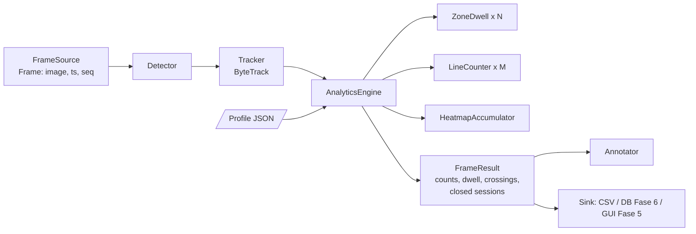

# FASE 3 — Multi-Object Tracking & Analytics Engine Inti

> Sebelumnya: [FASE-02](FASE-02-deteksi-sederhana-video-youtube.md) · Kembali ke [Roadmap](00-ROADMAP.md) · Berikutnya: [FASE-04 RTSP](FASE-04-integrasi-rtsp-ip-camera.md)
> Referensi Proposal: **§1** (kemampuan dasar), **§6** (Analytics Engine “digerakkan KONFIGURASI”), **§7** (ByteTrack, BoT-SORT, Supervision), **§8.2** (dwell time + heatmap), **§8.5** (line counter `sv.LineZone`), **§4 RM-1 & RM-2**
> Estimasi: **3 minggu** · Milestone: **M2 — Analytics Engine**

---

## 1. Tujuan

1. Menambahkan **Multi-Object Tracking** (ByteTrack) sehingga setiap orang punya **ID stabil**.
2. Membangun **Analytics Engine modular** yang sepenuhnya digerakkan oleh profil JSON:
   - **Dwell time** per zona (label “ID 7 | 2m 15s”, seperti video referensi Proposal §2),
   - **Line-crossing** masuk/keluar,
   - **Okupansi** (jumlah orang per zona, rata-rata & maksimum),
   - **Heatmap** titik kaki.
3. Menyusun **`Pipeline`** (Source → Detector → Tracker → Engine → Annotator) yang dipakai ulang tanpa perubahan oleh RTSP (Fase 4) dan GUI (Fase 5).
4. Memperbaiki kelemahan skrip POC Proposal §8.2 (lihat §2 di bawah).

## 2. Perbaikan atas Skrip POC Proposal §8.2

| Masalah pada §8.2 | Dampak | Solusi di Fase 3 |
|---|---|---|
| Dwell dihitung dari **jumlah frame** (`frames_in_zone[tid] += 1` lalu `/ fps`) | Pada RTSP, frame bisa **di-drop** saat inferensi lambat → dwell **terlalu kecil**; pada video, FPS metadata bisa tidak akurat | Dwell berbasis **timestamp** (`ts` dari sumber: waktu video untuk file, `time.monotonic()` untuk RTSP) |
| Tidak ada konsep **keluar zona** — dwell terus terakumulasi total seumur ID | Tidak bisa menghasilkan *sesi kunjungan* (masuk jam X, keluar jam Y) | **Sesi dwell** dengan waktu mulai/selesai, ditutup setelah *grace period* |
| ID hilang sesaat (occlusion) langsung dianggap orang baru/berhenti | Dwell terpotong-potong | **Grace period** (default 1,5 s) + `lost_track_buffer` ByteTrack |
| `cv2.circle(heatmap, …, 1.0, -1)` **menimpa** nilai (bukan menambah) | Heatmap hanya biner “pernah dilewati”, bukan intensitas keramaian | Akumulasi histogram 2D (`np.add.at`) + blur saat render |
| Satu zona di-*hardcode* | Tidak generik | Multi-zona & multi-garis dari profil (Proposal §8.4) |

> Tabel ini layak masuk Bab IV sebagai bukti **proses rekayasa & perbaikan** dari POC ke sistem.

## 3. Arsitektur Modul



```
aio_cctv/
├── sources/
│   ├── base.py              # Frame, FrameSource (antarmuka)
│   └── file_source.py       # FileSource (ts = waktu video)
├── tracking/
│   └── tracker.py           # ByteTrackTracker, UltralyticsTracker (BoT-SORT)
├── analytics/
│   ├── events.py            # DwellSession, CrossingEvent, FrameResult
│   ├── dwell.py             # ZoneDwell
│   ├── lines.py             # LineCounter
│   ├── heatmap.py           # HeatmapAccumulator
│   ├── engine.py            # AnalyticsEngine
│   └── annotate.py          # Annotator (gambar label, zona, garis)
├── pipeline.py              # Pipeline
scripts/run_analytics.py     # CLI: video -> video beranotasi + CSV + heatmap + summary
tests/test_dwell.py
```

---

## 4. Implementasi

### 4.1 Antarmuka sumber — `aio_cctv/sources/base.py`

```python
from __future__ import annotations

from dataclasses import dataclass
from typing import Protocol

import numpy as np


@dataclass
class Frame:
    image: np.ndarray
    ts: float          # detik, monoton (dipakai untuk durasi)
    wall_ts: float     # epoch detik (dipakai untuk penyimpanan, Fase 6)
    seq: int


class FrameSource(Protocol):
    fps: float
    resolution: tuple[int, int]
    def start(self) -> None: ...
    def read(self) -> Frame | None: ...     # None = belum ada frame baru / selesai
    def stop(self) -> None: ...
    @property
    def finished(self) -> bool: ...
```

### 4.2 `aio_cctv/sources/file_source.py`

```python
import time

import cv2

from aio_cctv.sources.base import Frame


class FileSource:
    """Sumber file video. ts = posisi waktu video, sehingga hasil deterministik & bisa diulang."""

    def __init__(self, path: str):
        self.path = path
        self.cap = cv2.VideoCapture(path)
        if not self.cap.isOpened():
            raise IOError(f"Tidak bisa membuka {path}")
        self.fps = self.cap.get(cv2.CAP_PROP_FPS) or 25.0
        self.resolution = (int(self.cap.get(cv2.CAP_PROP_FRAME_WIDTH)),
                           int(self.cap.get(cv2.CAP_PROP_FRAME_HEIGHT)))
        self._seq = 0
        self._finished = False
        self._t0_wall = time.time()

    def start(self) -> None:
        pass

    def read(self) -> Frame | None:
        ok, img = self.cap.read()
        if not ok:
            self._finished = True
            return None
        self._seq += 1
        ts = self.cap.get(cv2.CAP_PROP_POS_MSEC) / 1000.0 or self._seq / self.fps
        return Frame(img, ts, self._t0_wall + ts, self._seq)

    def stop(self) -> None:
        self.cap.release()

    @property
    def finished(self) -> bool:
        return self._finished
```

### 4.3 Tracker — `aio_cctv/tracking/tracker.py`

```python
import supervision as sv


class ByteTrackTracker:
    """ByteTrack (Zhang et al., 2022) via Supervision — pilihan utama Proposal §7."""

    def __init__(self, fps: float, lost_track_seconds: float = 2.0,
                 activation_threshold: float = 0.25, matching_threshold: float = 0.8):
        self.fps = fps
        self._t = sv.ByteTrack(
            track_activation_threshold=activation_threshold,
            lost_track_buffer=int(round(fps * lost_track_seconds)),
            minimum_matching_threshold=matching_threshold,
            frame_rate=int(round(fps)),
        )

    def update(self, det: sv.Detections) -> sv.Detections:
        return self._t.update_with_detections(det)

    def reset(self) -> None:
        self._t.reset()
```

Alternatif **BoT-SORT** (Proposal §7) untuk dibandingkan di Fase 9 — memakai tracker bawaan Ultralytics:

```python
class UltralyticsTracker:
    """Detector+tracker sekaligus: model.track(persist=True, tracker='botsort.yaml')."""

    def __init__(self, weights: str, tracker_cfg: str = "botsort.yaml", classes=(0,), conf=0.35):
        from ultralytics import YOLO
        self.model, self.cfg, self.classes, self.conf = YOLO(weights), tracker_cfg, list(classes), conf

    def detect_and_track(self, frame) -> sv.Detections:
        r = self.model.track(frame, persist=True, tracker=self.cfg, classes=self.classes,
                             conf=self.conf, verbose=False)[0]
        return sv.Detections.from_ultralytics(r)
```

> Parameter `lost_track_seconds` dikonversi ke frame berdasar FPS sumber — penting karena FPS kamera IP konsumer bervariasi (10–25 fps).

### 4.4 Event & hasil — `aio_cctv/analytics/events.py`

```python
from dataclasses import dataclass, field

import supervision as sv


@dataclass
class DwellSession:
    zone_id: str
    track_id: int
    start: float
    end: float

    @property
    def duration(self) -> float:
        return self.end - self.start


@dataclass
class CrossingEvent:
    line_id: str
    track_id: int
    direction: str      # "in" | "out"
    ts: float


@dataclass
class FrameResult:
    ts: float
    detections: sv.Detections
    zone_counts: dict[str, int] = field(default_factory=dict)
    dwell_now: dict[int, dict[str, float]] = field(default_factory=dict)   # tid -> {zone: detik}
    line_totals: dict[str, tuple[int, int]] = field(default_factory=dict)  # line -> (in, out)
    closed_sessions: list[DwellSession] = field(default_factory=list)
    crossings: list[CrossingEvent] = field(default_factory=list)
```

### 4.5 Dwell per zona — `aio_cctv/analytics/dwell.py`

```python
import numpy as np
import supervision as sv

from aio_cctv.analytics.events import DwellSession


class ZoneDwell:
    """Sesi dwell per track di satu zona, berbasis timestamp + grace period."""

    def __init__(self, zone_id: str, polygon_px: np.ndarray, grace_s: float = 1.5,
                 min_dwell_s: float = 1.0, anchor: sv.Position = sv.Position.BOTTOM_CENTER):
        self.zone_id = zone_id
        self.zone = sv.PolygonZone(polygon=polygon_px, triggering_anchors=(anchor,))
        self.grace_s, self.min_dwell_s = grace_s, min_dwell_s
        self.active: dict[int, list[float]] = {}      # tid -> [start, last_seen]

    def update(self, det: sv.Detections, ts: float) -> tuple[int, list[DwellSession]]:
        inside_ids: list[int] = []
        if len(det) and det.tracker_id is not None:
            mask = self.zone.trigger(det)
            inside_ids = [int(t) for t in det.tracker_id[mask]]
        for tid in inside_ids:
            if tid in self.active:
                self.active[tid][1] = ts
            else:
                self.active[tid] = [ts, ts]

        closed = []
        for tid, (start, last) in list(self.active.items()):
            if ts - last > self.grace_s:               # sudah keluar / hilang > grace
                del self.active[tid]
                if last - start >= self.min_dwell_s:   # buang "lewat sekilas"
                    closed.append(DwellSession(self.zone_id, tid, start, last))
        return len(inside_ids), closed

    def current(self, tid: int) -> float | None:
        s = self.active.get(tid)
        return None if s is None else s[1] - s[0]

    def flush(self) -> list[DwellSession]:
        """Tutup semua sesi aktif (akhir video / kamera dimatikan)."""
        out = [DwellSession(self.zone_id, t, s, e) for t, (s, e) in self.active.items()
               if e - s >= self.min_dwell_s]
        self.active.clear()
        return out
```

### 4.6 Line counter — `aio_cctv/analytics/lines.py`

```python
import numpy as np
import supervision as sv

from aio_cctv.analytics.events import CrossingEvent


class LineCounter:
    """Hitung masuk/keluar (Proposal §8.5: sv.LineZone)."""

    def __init__(self, line_id: str, p1: np.ndarray, p2: np.ndarray, min_cross_frames: int = 1):
        """min_cross_frames: orang harus terlihat di sisi seberang garis selama N frame berturut-turut
        sebelum dihitung. Mencegah hitungan "kedip" in/out/in saat orang berdiri di atas garis
        atau bounding box bergetar."""
        self.line_id = line_id
        self.zone = sv.LineZone(start=sv.Point(int(p1[0]), int(p1[1])),
                                end=sv.Point(int(p2[0]), int(p2[1])),
                                triggering_anchors=(sv.Position.BOTTOM_CENTER,),
                                minimum_crossing_threshold=max(1, min_cross_frames))

    def update(self, det: sv.Detections, ts: float) -> list[CrossingEvent]:
        if not len(det) or det.tracker_id is None:
            return []
        crossed_in, crossed_out = self.zone.trigger(det)
        events = [CrossingEvent(self.line_id, int(t), "in", ts) for t in det.tracker_id[crossed_in]]
        events += [CrossingEvent(self.line_id, int(t), "out", ts) for t in det.tracker_id[crossed_out]]
        return events

    @property
    def totals(self) -> tuple[int, int]:
        return self.zone.in_count, self.zone.out_count
```

> **Ambang crossing (`line_min_cross_s`, default 0,5 s):** tanpa ambang, orang yang berdiri di atas garis atau kotak yang bergetar tercatat in→out→in berkali-kali. Pada `ref1` (13 fps), ambang 0,5 s menghilangkan semua hitungan bolak-balik < 1 s, sedangkan ≥ 0,8 s mulai membuang orang yang benar-benar melintas.

> Arah “in/out” pada `LineZone` ditentukan urutan titik `p1 → p2`. Di editor (Fase 1/5) tampilkan panah arah, dan sediakan tombol **“balik arah”** (tukar p1/p2).

### 4.7 Heatmap — `aio_cctv/analytics/heatmap.py`

```python
import cv2
import numpy as np
import supervision as sv


class HeatmapAccumulator:
    """Histogram 2D titik kaki. cell = ukuran sel (px) -> hemat memori & cepat."""

    def __init__(self, w: int, h: int, cell: int = 8, decay: float = 1.0):
        self.w, self.h, self.cell, self.decay = w, h, cell, decay
        self.acc = np.zeros((h // cell + 1, w // cell + 1), dtype=np.float32)

    def update(self, det: sv.Detections) -> None:
        if self.decay < 1.0:
            self.acc *= self.decay           # heatmap "bergerak" untuk mode live
        if not len(det):
            return
        pts = det.get_anchors_coordinates(sv.Position.BOTTOM_CENTER)
        xs = np.clip((pts[:, 0] // self.cell).astype(int), 0, self.acc.shape[1] - 1)
        ys = np.clip((pts[:, 1] // self.cell).astype(int), 0, self.acc.shape[0] - 1)
        np.add.at(self.acc, (ys, xs), 1.0)   # AKUMULASI (perbaikan dari §8.2)

    def render(self, background: np.ndarray | None = None, alpha: float = 0.55) -> np.ndarray:
        hm = cv2.resize(self.acc, (self.w, self.h), interpolation=cv2.INTER_LINEAR)
        hm = cv2.GaussianBlur(hm, (0, 0), sigmaX=self.cell * 3)
        hm = cv2.normalize(hm, None, 0, 255, cv2.NORM_MINMAX).astype(np.uint8)
        color = cv2.applyColorMap(hm, cv2.COLORMAP_JET)
        if background is None:
            return color
        return cv2.addWeighted(color, alpha, background, 1 - alpha, 0)
```

Karena setiap frame menambah 1 pada sel yang ditempati, intensitas heatmap = **orang × waktu** di lokasi itu (“area paling ramai”, Proposal §1).

### 4.8 Engine — `aio_cctv/analytics/engine.py`

```python
from aio_cctv.analytics.dwell import ZoneDwell
from aio_cctv.analytics.events import FrameResult
from aio_cctv.analytics.heatmap import HeatmapAccumulator
from aio_cctv.analytics.lines import LineCounter
from aio_cctv.zones.models import Profile, to_pixels


class AnalyticsEngine:
    """Satu engine untuk semua jenis bisnis; perilakunya 100% dari Profile (Proposal §6)."""

    def __init__(self, profile: Profile, frame_wh: tuple[int, int],
                 grace_s: float = 1.5, min_dwell_s: float = 1.0,
                 fps: float | None = None, line_min_cross_s: float = 0.5):
        w, h = frame_wh
        # ambang crossing dalam detik -> frame, agar konsisten di kamera dengan FPS berbeda
        min_cross_frames = max(1, round(fps * line_min_cross_s)) if fps else 1
        self.profile = profile
        self.zones = [ZoneDwell(z.id, to_pixels(z.polygon, w, h), grace_s, min_dwell_s)
                      for z in profile.zones]
        self.lines = []
        for ln in profile.lines:
            p1, p2 = to_pixels([ln.p1, ln.p2], w, h)
            self.lines.append(LineCounter(ln.id, p1, p2, min_cross_frames))
        self.heatmap = HeatmapAccumulator(w, h)

    def update(self, det, ts: float) -> FrameResult:
        res = FrameResult(ts=ts, detections=det)
        for zd in self.zones:
            count, closed = zd.update(det, ts)
            res.zone_counts[zd.zone_id] = count
            res.closed_sessions += closed
        for lc in self.lines:
            res.crossings += lc.update(det, ts)
            res.line_totals[lc.line_id] = lc.totals
        self.heatmap.update(det)
        if det.tracker_id is not None:
            for tid in det.tracker_id:
                per_zone = {zd.zone_id: d for zd in self.zones if (d := zd.current(int(tid))) is not None}
                if per_zone:
                    res.dwell_now[int(tid)] = per_zone
        return res

    def flush(self):
        out = []
        for zd in self.zones:
            out += zd.flush()
        return out
```

### 4.9 Annotator — `aio_cctv/analytics/annotate.py`

```python
import supervision as sv

from aio_cctv.analytics.events import FrameResult
from aio_cctv.zones.models import Profile, to_pixels


def fmt_duration(sec: float) -> str:
    """Format seperti Proposal §8.2: '1h 15m', '2m 5s', '8s'."""
    m, s = divmod(int(sec), 60)
    h, m = divmod(m, 60)
    return f"{h}h {m}m" if h else f"{m}m {s}s" if m else f"{s}s"


class Annotator:
    def __init__(self, profile: Profile, frame_wh):
        w, h = frame_wh
        self.box = sv.BoxAnnotator(thickness=2, color_lookup=sv.ColorLookup.TRACK)
        self.label = sv.LabelAnnotator(text_scale=0.5, color_lookup=sv.ColorLookup.TRACK)
        self.trace = sv.TraceAnnotator(trace_length=40, color_lookup=sv.ColorLookup.TRACK)
        self.zone_polys = [(z, to_pixels(z.polygon, w, h)) for z in profile.zones]
        self.line_pts = [(ln, to_pixels([ln.p1, ln.p2], w, h)) for ln in profile.lines]

    def annotate(self, frame, res: FrameResult):
        det = res.detections
        img = frame.copy()
        for z, poly in self.zone_polys:
            img = sv.draw_polygon(img, poly, sv.Color.from_hex(z.color), thickness=2)
            cx, cy = poly.mean(axis=0).astype(int)
            img = sv.draw_text(img, f"{z.name}: {res.zone_counts.get(z.id, 0)}",
                               sv.Point(int(cx), int(cy)), background_color=sv.Color.from_hex(z.color))
        for ln, (p1, p2) in self.line_pts:
            tin, tout = res.line_totals.get(ln.id, (0, 0))
            img = sv.draw_line(img, sv.Point(*map(int, p1)), sv.Point(*map(int, p2)),
                               sv.Color.from_hex(ln.color), thickness=3)
            img = sv.draw_text(img, f"{ln.name} IN {tin} / OUT {tout}", sv.Point(*map(int, p1)),
                               background_color=sv.Color.from_hex(ln.color))
        if len(det) and det.tracker_id is not None:
            labels = []
            for tid in det.tracker_id:
                dz = res.dwell_now.get(int(tid))
                labels.append(f"ID {tid} | {fmt_duration(max(dz.values()))}" if dz else f"ID {tid}")
            img = self.trace.annotate(img, det)
            img = self.box.annotate(img, det)
            img = self.label.annotate(img, det, labels=labels)
        return img
```

### 4.10 Pipeline — `aio_cctv/pipeline.py`

```python
import time
from dataclasses import dataclass, field

from aio_cctv.analytics.annotate import Annotator
from aio_cctv.analytics.engine import AnalyticsEngine
from aio_cctv.inference.detector import Detector
from aio_cctv.tracking.tracker import ByteTrackTracker
from aio_cctv.zones.models import Profile


@dataclass
class StageTimes:                     # dipakai profiling Fase 8
    detect_ms: float = 0
    track_ms: float = 0
    analytics_ms: float = 0
    history: list = field(default_factory=list)


class Pipeline:
    def __init__(self, profile: Profile, frame_wh, fps: float, weights="models/yolo11n.pt",
                 conf=0.35, imgsz=640):
        self.detector = Detector(weights, profile.target_classes, conf, imgsz=imgsz)
        self.tracker = ByteTrackTracker(fps)
        self.engine = AnalyticsEngine(profile, frame_wh, fps=fps)
        self.annotator = Annotator(profile, frame_wh)
        self.times = StageTimes()

    def step(self, image, ts):
        t0 = time.perf_counter()
        det = self.detector(image)
        t1 = time.perf_counter()
        det = self.tracker.update(det)
        t2 = time.perf_counter()
        res = self.engine.update(det, ts)
        t3 = time.perf_counter()
        self.times.detect_ms, self.times.track_ms, self.times.analytics_ms = (
            (t1 - t0) * 1e3, (t2 - t1) * 1e3, (t3 - t2) * 1e3)
        return res

    def annotate(self, image, res):
        return self.annotator.annotate(image, res)
```

### 4.11 CLI — `scripts/run_analytics.py`

Menjalankan pipeline pada video YouTube dan menghasilkan:
`annotated.mp4`, `dwell_sessions.csv` (zone, track, start, end, duration), `crossings.csv`, `occupancy_per_second.csv`, `heatmap.png`, `heatmap_overlay.png`, `summary.json` (rata-rata/median dwell per zona, total in/out, okupansi maks, FPS).

```python
import argparse, csv, json, statistics
from pathlib import Path

import cv2
import supervision as sv

from aio_cctv.pipeline import Pipeline
from aio_cctv.sources.file_source import FileSource
from aio_cctv.zones.models import Profile

ap = argparse.ArgumentParser()
ap.add_argument("--profile", required=True)
ap.add_argument("--video")
ap.add_argument("--out", default="outputs")
ap.add_argument("--show", action="store_true")
args = ap.parse_args()

profile = Profile.load(args.profile)
src = FileSource(args.video or profile.source.uri)
pipe = Pipeline(profile, src.resolution, src.fps)
out = Path(args.out) / profile.profile_id
out.mkdir(parents=True, exist_ok=True)

sessions, crossings, occupancy, first = [], [], [], None
info = sv.VideoInfo(width=src.resolution[0], height=src.resolution[1], fps=src.fps)
with sv.VideoSink(str(out / "annotated.mp4"), info) as sink:
    while (f := src.read()) is not None:
        first = first if first is not None else f.image
        res = pipe.step(f.image, f.ts)
        sessions += res.closed_sessions
        crossings += res.crossings
        if f.seq % max(1, round(src.fps)) == 0:
            occupancy.append({"t": round(f.ts, 1), **res.zone_counts})
        vis = pipe.annotate(f.image, res)
        sink.write_frame(vis)
        if args.show:
            cv2.imshow("AIO-CCTV | Analitik", vis)
            if cv2.waitKey(1) & 0xFF == ord("q"):
                break
sessions += pipe.engine.flush()
src.stop()

with open(out / "dwell_sessions.csv", "w", newline="") as fh:
    w = csv.writer(fh); w.writerow(["zone_id", "track_id", "start_s", "end_s", "duration_s"])
    w.writerows([[s.zone_id, s.track_id, f"{s.start:.2f}", f"{s.end:.2f}", f"{s.duration:.2f}"] for s in sessions])
with open(out / "crossings.csv", "w", newline="") as fh:
    w = csv.writer(fh); w.writerow(["line_id", "track_id", "direction", "t_s"])
    w.writerows([[c.line_id, c.track_id, c.direction, f"{c.ts:.2f}"] for c in crossings])
with open(out / "occupancy_per_second.csv", "w", newline="") as fh:
    w = csv.DictWriter(fh, fieldnames=["t"] + [z.id for z in profile.zones])
    w.writeheader(); w.writerows(occupancy)

cv2.imwrite(str(out / "heatmap.png"), pipe.engine.heatmap.render())
cv2.imwrite(str(out / "heatmap_overlay.png"), pipe.engine.heatmap.render(first))

summary = {"zones": {}, "lines": {}}
for z in profile.zones:
    d = [s.duration for s in sessions if s.zone_id == z.id]
    occ = [o[z.id] for o in occupancy]
    summary["zones"][z.name] = {
        "sessions": len(d),
        "dwell_mean_s": round(statistics.mean(d), 1) if d else 0,
        "dwell_median_s": round(statistics.median(d), 1) if d else 0,
        "occupancy_max": max(occ, default=0),
        "occupancy_mean": round(statistics.mean(occ), 2) if occ else 0,
    }
for ln in profile.lines:
    summary["lines"][ln.name] = {"in": sum(c.direction == "in" and c.line_id == ln.id for c in crossings),
                                 "out": sum(c.direction == "out" and c.line_id == ln.id for c in crossings)}
(out / "summary.json").write_text(json.dumps(summary, indent=2, ensure_ascii=False))
print(json.dumps(summary, indent=2, ensure_ascii=False))
```

### 4.12 Unit test dwell — `tests/test_dwell.py`

Uji logika dengan **deteksi sintetis** (tanpa model), sehingga cepat & deterministik:

```python
import numpy as np
import supervision as sv

from aio_cctv.analytics.dwell import ZoneDwell

POLY = np.array([[0, 0], [100, 0], [100, 100], [0, 100]])


def det_at(x, y, tid):
    return sv.Detections(xyxy=np.array([[x - 5, y - 20, x + 5, y]], dtype=float),
                         tracker_id=np.array([tid]), class_id=np.array([0]),
                         confidence=np.array([0.9]))


def test_session_closed_after_grace():
    zd = ZoneDwell("z", POLY, grace_s=1.0, min_dwell_s=0.5)
    for t in np.arange(0, 5.0, 0.1):          # di dalam zona selama 5 detik
        zd.update(det_at(50, 50, 1), t)
    _, closed = zd.update(sv.Detections.empty(), 6.5)   # keluar > grace
    assert len(closed) == 1 and abs(closed[0].duration - 4.9) < 0.11


def test_short_occlusion_does_not_split_session():
    zd = ZoneDwell("z", POLY, grace_s=1.5)
    for t in np.arange(0, 3, 0.1):
        zd.update(det_at(50, 50, 1), t)
    zd.update(sv.Detections.empty(), 3.8)       # hilang 0.9 s (< grace)
    for t in np.arange(4, 6, 0.1):
        zd.update(det_at(50, 50, 1), t)
    assert zd.current(1) > 5.5                  # masih satu sesi
```

---

## 5. Eksperimen & Tuning (dicatat untuk Bab IV)

| Eksperimen | Variasi | Ukuran yang diamati |
|---|---|---|
| Parameter ByteTrack | `lost_track_seconds` 1/2/4, `matching_threshold` 0.7/0.8/0.9 | Jumlah ID unik vs jumlah orang sebenarnya (ID switch kasar) |
| Grace period dwell | 0.5 / 1.5 / 3 s | Jumlah sesi terpotong vs pengamatan manual |
| ByteTrack vs BoT-SORT | 2 tracker × 3 video | FPS, jumlah ID unik, kestabilan label |
| Anchor zona | BOTTOM_CENTER vs CENTER | Akurasi okupansi untuk orang duduk |

Metrik formal (MOTA, IDF1) dihitung di Fase 9 memakai MOT17/MOT20 (Proposal §10, §13).

## 6. Keluaran (Deliverables)

| Keluaran | Lokasi |
|---|---|
| Modul `sources`, `tracking`, `analytics`, `pipeline.py` | `aio_cctv/` |
| CLI analitik lengkap | `scripts/run_analytics.py` |
| Untuk ≥3 video YouTube: video beranotasi, CSV sesi, CSV crossing, heatmap, summary | `outputs/` |
| Unit test dwell (& line counter) | `tests/` |
| Tabel eksperimen tuning | `docs/logbook/` |
| **Demo M2** — tampilan setara video referensi Proposal §2 | `docs/demo/m2.mp4` |

## 7. Definition of Done

- [ ] Label “ID n | durasi” tampil dan bertambah secara wajar saat orang diam di zona.
- [ ] Sesi dwell tertutup benar saat orang keluar zona; occlusion singkat tidak memecah sesi (terbukti unit test).
- [ ] Line counter menghitung in/out sesuai arah; tervalidasi manual pada ≥1 video.
- [ ] Heatmap menunjukkan gradasi intensitas (bukan biner).
- [ ] Mengganti profil JSON (zona/garis berbeda) **tanpa ubah kode** menghasilkan analitik berbeda — bukti awal RM-3.
- [ ] Tag `v0.3-analytics-engine`.

## 8. Risiko & Mitigasi

| Risiko | Mitigasi |
|---|---|
| ID switch tinggi pada kerumunan | Tuning, BoT-SORT + ReID (Proposal §7 OSNet), model deteksi lebih besar |
| Satu orang dihitung berkali-kali saat mondar-mandir di garis | `minimum_crossing_threshold` lewat `line_min_cross_s` (§4.6); letakkan garis di jalur orang berjalan, bukan tempat berdiri (keset, depan kasir) |
| API Supervision berubah antarversi | Kunci versi di `pyproject.toml` setelah fase ini stabil |
