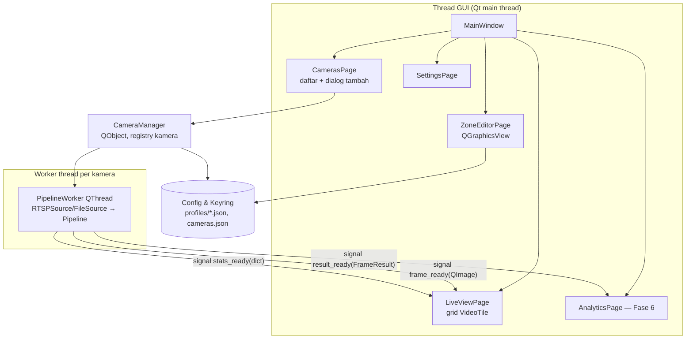

# FASE 5 — Aplikasi Desktop All-in-One (PyQt6)

> Sebelumnya: [FASE-04](FASE-04-integrasi-rtsp-ip-camera.md) · Kembali ke [Roadmap](00-ROADMAP.md) · Berikutnya: [FASE-06 Data & Dashboard](FASE-06-penyimpanan-dashboard-laporan.md)
> Referensi Proposal: **§7** (“Agen edge: Python + PyQt6 (desktop)… berjalan di lokasi pelanggan, olah video lokal”), **§8.5** (“Editor zona visual… klik-tarik poligon di atas snapshot kamera → hasilkan JSON otomatis”, “Multi-zona & multi-kamera”), **§6** (edge/on-premise), **§12** judul #3 (“Aplikasi Desktop All-in-One”)
> Estimasi: **4 minggu** · Milestone: **M4 — Aplikasi All-in-One** (bagian 1)

---

## 1. Tujuan

Menyatukan semua kemampuan Fase 1–4 menjadi **satu aplikasi desktop** yang dapat dipakai **tanpa terminal** oleh pemilik usaha:

1. **Manajemen kamera**: tambah kamera (pilih merek → isi IP/kredensial → *Tes Koneksi*), ONVIF discovery, sumber file video/YouTube untuk demo.
2. **Live view multi-kamera** (grid 1/2×2/3×3) dengan overlay analitik real-time.
3. **Editor zona visual** (klik-tarik poligon, drag titik, rename, tipe, warna, balik arah garis) — pengganti editor OpenCV Fase 1.
4. **Kontrol pipeline per kamera** (start/stop, model, confidence, sub/main-stream) dan **status kesehatan stream**.
5. GUI **tidak pernah membeku**: semua pekerjaan berat di thread terpisah.

## 2. Arsitektur Aplikasi



Prinsip:
- **Model–View terpisah**: `CameraManager` tidak tahu soal widget; widget hanya mendengar *signal*.
- Komunikasi thread → GUI **hanya lewat signal Qt** (thread-safe, otomatis *queued connection*).
- `Pipeline` dari Fase 3 dipakai **apa adanya** di dalam worker.

## 3. Struktur File

```
aio_cctv/gui/
├── app.py                    # QApplication, tema, entry
├── main_window.py            # sidebar navigasi + QStackedWidget
├── camera_manager.py         # registry kamera, start/stop worker, persistensi
├── workers/
│   └── pipeline_worker.py    # QThread: source -> pipeline -> signal
├── pages/
│   ├── live_view.py          # grid VideoTile
│   ├── cameras.py            # tabel kamera + tombol tambah/edit/hapus
│   ├── zone_editor.py        # editor zona visual
│   └── settings.py
├── dialogs/
│   └── add_camera.py         # merek, IP, user, pass, stream, tes koneksi, discovery
├── widgets/
│   ├── video_tile.py         # tampilan frame + badge status
│   └── polygon_item.py       # poligon dengan titik yang bisa di-drag
└── utils.py                  # to_qimage, ikon, dsb.
aio_cctv/core/
├── paths.py                  # lokasi data app (platformdirs)
└── secrets.py                # simpan/ambil password via keyring
main.py
```

## 4. Rancangan Antarmuka

```
┌──────────────────────────────────────────────────────────────────────────────┐
│ AIO-CCTV Analytics                                         ● 3 kamera online │
├────────────┬─────────────────────────────────────────────────────────────────┤
│ ▶ Live     │ ┌───────────────────────┐ ┌───────────────────────┐             │
│   Kamera   │ │ Kasir (Tapo C200)  ●  │ │ Pintu (Imou)       ●  │  Grid: [2x2]│
│   Zona     │ │ [video + overlay]     │ │ [video + overlay]     │             │
│   Analitik │ │ 14.8 fps | 3 org      │ │ 12.1 fps | IN 42/OUT 38│            │
│   Laporan  │ └───────────────────────┘ └───────────────────────┘             │
│   Alert    │ ┌───────────────────────┐ ┌───────────────────────┐             │
│   Pengaturan││ Demo YouTube (file) ● │ │  + Tambah kamera      │             │
│            │ │ [video + overlay]     │ │                       │             │
│            │ └───────────────────────┘ └───────────────────────┘             │
├────────────┴─────────────────────────────────────────────────────────────────┤
│ Status: Kasir streaming | Pintu reconnecting (#2) | GPU 41% | CPU 23%        │
└──────────────────────────────────────────────────────────────────────────────┘
```

Halaman **Zona**:

```
┌ Kamera: [Kasir ▼]  [Ambil snapshot]  Mode: (•) Zona ( ) Garis   [Simpan] [Batal] ┐
│ ┌──────────────────────────────────────────────┐ ┌ Daftar ─────────────────┐     │
│ │  snapshot kamera                              │ │ ■ Meja Pelanggan  dwell │     │
│ │   ┌───────┐   ← titik dapat di-drag            │ │ ■ Area Kasir  occupancy │     │
│ │   │ zona  │                                    │ │ ─ Pintu Masuk  counting │     │
│ │   └───────┘   ——→ garis + panah arah IN        │ ├ Properti ───────────────┤     │
│ │                                                │ │ Nama  [Area Kasir    ]  │     │
│ └──────────────────────────────────────────────┘ │ Tipe  [occupancy ▼]     │     │
│                                                    │ Warna [■]  [Balik arah] │     │
└────────────────────────────────────────────────────┴─────────────────────────┘     ┘
```

---

## 5. Implementasi Kunci

### 5.1 Utilitas konversi — `aio_cctv/gui/utils.py`

```python
import cv2
import numpy as np
from PyQt6.QtGui import QImage


def to_qimage(bgr: np.ndarray) -> QImage:
    rgb = cv2.cvtColor(bgr, cv2.COLOR_BGR2RGB)
    h, w, _ = rgb.shape
    # .copy() wajib: buffer numpy akan hilang setelah fungsi selesai
    return QImage(rgb.data, w, h, 3 * w, QImage.Format.Format_RGB888).copy()
```

### 5.2 Worker — `aio_cctv/gui/workers/pipeline_worker.py`

```python
import time

from PyQt6.QtCore import QThread, pyqtSignal
from PyQt6.QtGui import QImage

from aio_cctv.gui.utils import to_qimage
from aio_cctv.pipeline import Pipeline
from aio_cctv.sources.file_source import FileSource
from aio_cctv.sources.rtsp_source import RTSPSource
from aio_cctv.zones.models import Profile


class PipelineWorker(QThread):
    frame_ready = pyqtSignal(str, QImage)          # cam_id, frame beranotasi
    stats_ready = pyqtSignal(str, dict)            # cam_id, fps/state/latensi
    result_ready = pyqtSignal(str, object)         # cam_id, FrameResult (untuk Fase 6)
    error = pyqtSignal(str, str)

    def __init__(self, cam_id: str, source_uri: str, profile: Profile, settings: dict):
        super().__init__()
        self.cam_id, self.uri, self.profile, self.settings = cam_id, source_uri, profile, settings
        self.max_display_fps = settings.get("display_fps", 15)

    def _make_source(self):
        if self.uri.startswith("rtsp://"):
            return RTSPSource(self.uri, name=self.cam_id)
        return FileSource(self.uri)

    def run(self) -> None:
        src = self._make_source()
        if src.start() is False:
            self.error.emit(self.cam_id, "Tidak dapat terhubung ke kamera")
        try:
            pipe = None
            last_emit, n, t_fps = 0.0, 0, time.monotonic()
            while not self.isInterruptionRequested():
                f = src.read()
                if f is None:
                    if src.finished and isinstance(src, FileSource):
                        break
                    self.msleep(3)
                    continue
                if pipe is None:                   # dibuat di thread ini (model + resolusi aktual)
                    pipe = Pipeline(self.profile, src.resolution, src.fps or 15,
                                    weights=self.settings.get("weights", "models/yolo11n.pt"),
                                    conf=self.settings.get("conf", 0.35))
                res = pipe.step(f.image, f.ts)
                self.result_ready.emit(self.cam_id, res)
                n += 1

                now = time.monotonic()
                if now - last_emit >= 1.0 / self.max_display_fps:   # batasi beban repaint GUI
                    self.frame_ready.emit(self.cam_id, to_qimage(pipe.annotate(f.image, res)))
                    last_emit = now
                if now - t_fps >= 1.0:
                    self.stats_ready.emit(self.cam_id, {
                        "state": getattr(src, "state", "file"),
                        "proc_fps": n / (now - t_fps),
                        "detect_ms": pipe.times.detect_ms,
                        "persons": len(res.detections),
                        "reconnects": getattr(getattr(src, "stats", None), "reconnects", 0),
                    })
                    n, t_fps = 0, now
        except Exception as e:                     # jangan biarkan thread mati diam-diam
            self.error.emit(self.cam_id, f"{type(e).__name__}: {e}")
        finally:
            src.stop()

    def stop(self) -> None:
        self.requestInterruption()
        self.wait(5000)
```

> Pada file video, loop berjalan secepat inferensi (bukan real-time). Tambahkan opsi “putar sesuai FPS asli” untuk demo YouTube agar terlihat seperti kamera live (tidur `1/fps − waktu_proses`).

### 5.3 Tile video — `aio_cctv/gui/widgets/video_tile.py`

```python
from PyQt6.QtCore import Qt
from PyQt6.QtGui import QImage, QPixmap
from PyQt6.QtWidgets import QLabel, QSizePolicy, QVBoxLayout, QWidget

STATE_COLOR = {"streaming": "#43A047", "file": "#1E88E5", "connecting": "#FB8C00",
               "reconnecting": "#E53935", "stopped": "#757575"}


class VideoTile(QWidget):
    def __init__(self, cam_id: str, title: str):
        super().__init__()
        self.cam_id = cam_id
        self.header = QLabel(title)
        self.view = QLabel(alignment=Qt.AlignmentFlag.AlignCenter)
        self.view.setSizePolicy(QSizePolicy.Policy.Ignored, QSizePolicy.Policy.Ignored)
        self.view.setStyleSheet("background:#111;")
        self.footer = QLabel("—")
        lay = QVBoxLayout(self)
        lay.setContentsMargins(2, 2, 2, 2)
        for w in (self.header, self.view, self.footer):
            lay.addWidget(w)
        lay.setStretch(1, 1)

    def set_frame(self, img: QImage) -> None:
        pix = QPixmap.fromImage(img).scaled(self.view.size(), Qt.AspectRatioMode.KeepAspectRatio,
                                            Qt.TransformationMode.SmoothTransformation)
        self.view.setPixmap(pix)

    def set_stats(self, s: dict) -> None:
        color = STATE_COLOR.get(s["state"], "#757575")
        self.header.setStyleSheet(f"border-left:6px solid {color}; padding-left:6px;")
        self.footer.setText(f"{s['state']} | {s['proc_fps']:.1f} fps | {s['persons']} orang"
                            f" | det {s['detect_ms']:.0f} ms | reconnect {s['reconnects']}")
```

### 5.4 CameraManager — `aio_cctv/gui/camera_manager.py`

```python
import json
from dataclasses import asdict, dataclass

from PyQt6.QtCore import QObject, pyqtSignal

from aio_cctv.core import secrets
from aio_cctv.core.paths import CAMERAS_FILE, PROFILES_DIR
from aio_cctv.gui.workers.pipeline_worker import PipelineWorker
from aio_cctv.sources.url_builder import build_url
from aio_cctv.zones.models import Profile


@dataclass
class CameraConfig:
    id: str
    name: str
    brand: str               # kunci camera_brands.json, atau "file"
    host: str = ""
    port: int | None = None
    user: str = ""
    stream: str = "sub"      # analitik default di sub-stream (Fase 4 §5.7)
    file_path: str = ""
    profile_id: str = ""
    enabled: bool = True


class CameraManager(QObject):
    cameras_changed = pyqtSignal()

    def __init__(self):
        super().__init__()
        self.cameras: dict[str, CameraConfig] = {}
        self.workers: dict[str, PipelineWorker] = {}
        self.load()

    def load(self) -> None:
        if CAMERAS_FILE.exists():
            for c in json.loads(CAMERAS_FILE.read_text()):
                self.cameras[c["id"]] = CameraConfig(**c)

    def save(self) -> None:
        CAMERAS_FILE.write_text(json.dumps([asdict(c) for c in self.cameras.values()], indent=2))
        self.cameras_changed.emit()

    def source_uri(self, cam: CameraConfig) -> str:
        if cam.brand == "file":
            return cam.file_path
        pw = secrets.get_password(cam.id)          # dari OS keyring, bukan dari file
        return build_url(cam.brand, cam.host, cam.user, pw, cam.stream, cam.port)

    def start(self, cam_id: str, settings: dict) -> PipelineWorker:
        cam = self.cameras[cam_id]
        profile = Profile.load(PROFILES_DIR / f"{cam.profile_id}.json")
        w = PipelineWorker(cam_id, self.source_uri(cam), profile, settings)
        self.workers[cam_id] = w
        w.start()
        return w

    def stop(self, cam_id: str) -> None:
        if (w := self.workers.pop(cam_id, None)) is not None:
            w.stop()

    def stop_all(self) -> None:
        for cid in list(self.workers):
            self.stop(cid)
```

`aio_cctv/core/secrets.py`:

```python
import keyring

SERVICE = "aio-cctv"


def set_password(cam_id: str, password: str) -> None:
    keyring.set_password(SERVICE, cam_id, password)


def get_password(cam_id: str) -> str:
    return keyring.get_password(SERVICE, cam_id) or ""
```

`aio_cctv/core/paths.py`:

```python
from pathlib import Path

from platformdirs import user_data_dir

APP_DIR = Path(user_data_dir("aio-cctv", "tugasakhir"))
PROFILES_DIR = APP_DIR / "profiles"
CAMERAS_FILE = APP_DIR / "cameras.json"
DB_FILE = APP_DIR / "analytics.db"          # Fase 6
for d in (APP_DIR, PROFILES_DIR):
    d.mkdir(parents=True, exist_ok=True)
```

### 5.5 Dialog Tambah Kamera — alur

1. Pilih **jenis sumber**: Kamera IP (RTSP) / File video (termasuk video YouTube hasil unduhan) / Webcam.
2. Untuk kamera IP: tombol **“Cari di jaringan”** → `onvif_discover()` + `scan_rtsp_port()` (Fase 4) di `QThreadPool` → daftar IP.
3. Pilih **merek** (dropdown dari `camera_brands.json`) → isi user/password → tampil **pratinjau URL ter-mask**.
4. Tombol **“Tes Koneksi”** → `probe()` di background → tampilkan codec/resolusi/fps atau pesan error ramah (tabel Fase 4 §5.4). Tampilkan **snapshot**.
5. Simpan → password ke keyring, konfigurasi ke `cameras.json`, buat profil kosong → arahkan ke halaman **Zona**.

Semua operasi jaringan dijalankan dengan `QRunnable` + signal agar dialog tidak membeku.

### 5.6 Editor zona visual — `widgets/polygon_item.py` & `pages/zone_editor.py`

Konsep:
- `QGraphicsScene` berisi `QGraphicsPixmapItem` (snapshot kamera) sebagai latar.
- Setiap zona = `EditablePolygon` (`QGraphicsPolygonItem`) + beberapa `VertexHandle` (`QGraphicsEllipseItem`, *movable*). Menggeser handle memperbarui poligon.
- Garis = `QGraphicsLineItem` + panah arah IN.
- Saat simpan: koordinat piksel scene → **ternormalisasi** dengan ukuran pixmap → `Profile.save()` (skema Fase 1, tanpa perubahan).

```python
from PyQt6.QtCore import QPointF
from PyQt6.QtGui import QBrush, QColor, QPen, QPolygonF
from PyQt6.QtWidgets import QGraphicsEllipseItem, QGraphicsItem, QGraphicsPolygonItem


class VertexHandle(QGraphicsEllipseItem):
    R = 6

    def __init__(self, owner: "EditablePolygon", index: int, pos: QPointF):
        super().__init__(-self.R, -self.R, 2 * self.R, 2 * self.R)
        self.owner, self.index = owner, index
        self.setPos(pos)
        self.setBrush(QBrush(QColor("white")))
        self.setFlags(QGraphicsItem.GraphicsItemFlag.ItemIsMovable
                      | QGraphicsItem.GraphicsItemFlag.ItemSendsGeometryChanges)
        self.setZValue(10)

    def itemChange(self, change, value):
        if change == QGraphicsItem.GraphicsItemChange.ItemPositionHasChanged:
            self.owner.move_vertex(self.index, self.pos())
        return super().itemChange(change, value)


class EditablePolygon(QGraphicsPolygonItem):
    def __init__(self, zone_id: str, points: list[QPointF], color: str):
        super().__init__(QPolygonF(points))
        self.zone_id = zone_id
        c = QColor(color)
        self.setPen(QPen(c, 2))
        c.setAlpha(60)
        self.setBrush(QBrush(c))
        self.handles: list[VertexHandle] = []

    def attach_handles(self) -> None:          # dipanggil setelah item masuk ke scene
        for i, p in enumerate(self.polygon()):
            h = VertexHandle(self, i, p)
            self.scene().addItem(h)
            self.handles.append(h)

    def move_vertex(self, i: int, pos: QPointF) -> None:
        poly = self.polygon()
        poly[i] = pos
        self.setPolygon(poly)

    def normalized(self, w: int, h: int) -> list[tuple[float, float]]:
        return [(round(p.x() / (w - 1), 4), round(p.y() / (h - 1), 4)) for p in self.polygon()]
```

Fitur editor yang harus ada:
- Klik kiri menambah titik; klik-ganda / Enter menutup poligon; Esc membatalkan.
- Klik kanan pada zona: *Rename*, *Ubah tipe*, *Warna*, *Hapus*, *Duplikasi*.
- Validasi saat simpan: ≥3 titik, tidak *self-intersecting* (`shapely`), nama unik.
- Tombol **“Pratinjau deteksi”**: jalankan detektor sekali pada snapshot untuk memastikan zona menutup area kaki orang.
- Perubahan profil diterapkan ke kamera yang berjalan dengan **restart worker** (sederhana & aman) — *hot reload* opsional.

### 5.7 Main window & entry — `main.py`

```python
import sys

from PyQt6.QtWidgets import QApplication

from aio_cctv.gui.main_window import MainWindow


def main() -> None:
    app = QApplication(sys.argv)
    app.setApplicationName("AIO-CCTV Analytics")
    win = MainWindow()
    win.resize(1400, 850)
    win.show()
    sys.exit(app.exec())


if __name__ == "__main__":
    main()
```

`MainWindow.closeEvent` wajib memanggil `camera_manager.stop_all()` agar thread & koneksi RTSP ditutup rapi.

### 5.8 Halaman Pengaturan

| Pengaturan | Default | Keterangan |
|---|---|---|
| Model | `yolo11n` | n/s/m (+ ONNX/TensorRT setelah Fase 8) |
| Confidence | 0.35 | |
| Stream untuk analitik | sub | main/sub |
| FPS tampilan maks | 15 | kurangi beban GUI |
| Device | auto | cpu / cuda:0 |
| Grace period dwell | 1.5 s | Fase 3 |
| Bahasa | Indonesia | |
| Mulai otomatis saat aplikasi dibuka | aktif | kamera yang *enabled* langsung jalan |

Disimpan dengan `QSettings`.

---

## 6. Pengujian Fase 5

| Uji | Kriteria |
|---|---|
| Responsif | Menggeser jendela/berpindah halaman tetap mulus saat 4 kamera berjalan |
| Multi-kamera | 1 file YouTube + 1 MediaMTX + ≥2 kamera fisik berjalan bersamaan |
| Tambah kamera end-to-end | Pengguna awam (teman) berhasil menambah Tapo **tanpa bantuan** dengan mengikuti dialog (catat waktu → bahan SUS Fase 9) |
| Editor zona | Zona hasil GUI identik strukturnya dengan skema Fase 1 (lolos `Profile.load`) |
| Penutupan | Menutup aplikasi tidak meninggalkan proses/thread menggantung |
| Error | Kamera mati saat start → tile menampilkan status “reconnecting”, bukan crash |

## 7. Keluaran (Deliverables)

| Keluaran | Lokasi |
|---|---|
| Aplikasi GUI (`python main.py`) | `aio_cctv/gui/`, `main.py` |
| Diagram arsitektur thread & class diagram GUI | `docs/diagram/` (bahan Bab III) |
| Screenshot setiap halaman | `docs/logbook/img/` |

## 8. Definition of Done

- [ ] Alur lengkap tanpa terminal: tambah kamera → tes koneksi → gambar zona → live analitik.
- [ ] Minimal 4 sumber berjalan bersamaan tanpa GUI membeku.
- [ ] Password kamera hanya ada di keyring.
- [ ] Tag `v0.5-desktop-gui`.

## 9. Risiko & Mitigasi

| Risiko | Mitigasi |
|---|---|
| Beban GUI tinggi (konversi QImage per frame) | Batasi FPS tampilan, skala frame di worker sebelum emit untuk mode grid |
| Beberapa worker memuat model masing-masing → VRAM boros | Diterima di fase ini; **inferensi terpusat/batch** di Fase 8 |
| PyQt6 + OpenCV konflik plugin Qt (`cv2.imshow` bawaan Qt) | Gunakan `opencv-python-headless` di build GUI (imshow hanya untuk skrip CLI) |
| Keyring tidak tersedia di Linux tanpa Secret Service | Fallback `keyrings.alt` terenkripsi, beri peringatan di UI |
