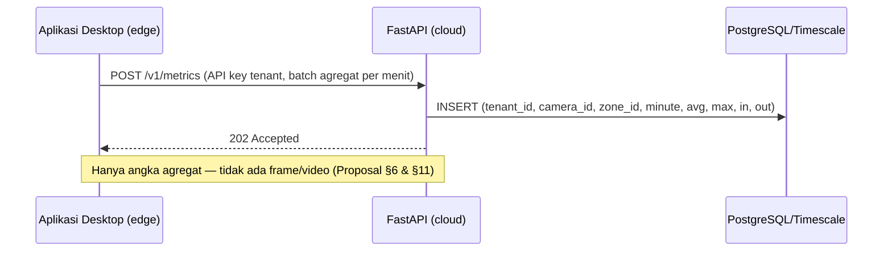

# FASE 7 — Profil Konfigurasi & Template Vertikal (+ Opsi Sinkronisasi Cloud)

> Sebelumnya: [FASE-06](FASE-06-penyimpanan-dashboard-laporan.md) · Kembali ke [Roadmap](00-ROADMAP.md) · Berikutnya: [FASE-08 Optimasi & Packaging](FASE-08-optimasi-packaging.md)
> Referensi Proposal: **§1** (tabel “Template per vertikal”), **§4 RM-3** (zona & aturan dapat dikonfigurasi tanpa mengubah kode), **§5** (2–3 template vertikal sebagai bukti kegenerikan), **§6** (“Perbedaan antar-jenis bisnis seluruhnya ditentukan oleh berkas konfigurasi”; komponen CLOUD), **§8.4** (konfigurasi per tenant), **§10** (metrik *Kegenerikan*: 0 baris kode)
> Estimasi: **2 minggu** · Milestone: **M4** (bagian 3 — aplikasi all-in-one lengkap)

---

## 1. Tujuan

1. Memformalkan **skema profil v2**: zona + garis + **aturan** + **parameter analitik** + **widget dashboard**, dengan migrasi otomatis dari v1.
2. Menyediakan **template vertikal** (minimal F&B/kafe, ritel, klinik — Proposal §5 meminta 2–3) yang dipasang lewat **wizard** di GUI.
3. **Import/export profil** (`.aioprofile`) agar konfigurasi bisa dipindah antar PC/lokasi.
4. Menyiapkan **bukti kuantitatif RM-3**: adaptasi ke bisnis baru = **0 baris kode**, diukur waktu & langkahnya.
5. (**Opsional**) Menjembatani ke visi SaaS Proposal §6: sinkronisasi **metrik agregat** ke backend FastAPI minimal.

## 2. Konsep: Template ≠ Profil

| | **Template** | **Profil** |
|---|---|---|
| Isi | *Slot* zona/garis (nama, tipe, deskripsi, anchor), aturan default, widget dashboard, parameter | Zona/garis **dengan koordinat** untuk satu kamera + aturan yang sudah disesuaikan |
| Sifat | Generik per jenis bisnis, dikirim bersama aplikasi | Spesifik lokasi/kamera, dibuat pengguna |
| Contoh | “F&B: Meja Pelanggan (dwell), Antrean Kasir (occupancy), Pintu (counting)” | “Kafe Kopi Senja – Kamera Kasir” |

Alur pengguna: **Pilih template → wizard meminta menggambar setiap slot di snapshot kamera → profil jadi** (aturan & dashboard otomatis terpasang).

## 3. Skema Profil v2

Tambahan terhadap v1 (Fase 1):

```python
# aio_cctv/core/profile_v2.py  (menggantikan zones/models.py sebagai sumber kebenaran)
from typing import Literal

from pydantic import BaseModel, Field

from aio_cctv.zones.models import Line, SourceConfig, Zone


class AnalyticsParams(BaseModel):
    conf: float = 0.35
    grace_s: float = 1.5
    min_dwell_s: float = 1.0
    lost_track_seconds: float = 2.0
    heatmap_cell: int = 8


class ZoneV2(Zone):
    anchor: Literal["bottom_center", "center"] = "bottom_center"   # 'center' utk orang duduk
    capacity: int | None = None                                      # utk % okupansi


class Rule(BaseModel):
    id: str
    type: Literal["occupancy_gt", "dwell_gt", "camera_offline", "traffic_gt_per_hour"]
    zone_id: str | None = None
    line_id: str | None = None
    threshold: float | None = None
    for_s: float = 0
    cooldown_s: float = 300
    message: str = ""
    enabled: bool = True


class DashboardWidget(BaseModel):
    type: Literal["kpi", "traffic_hourly", "occupancy_trend", "dwell_table", "heatmap"]
    target: str | None = None          # zone_id / line_id
    title: str = ""


class ProfileV2(BaseModel):
    schema_version: Literal[2] = 2
    profile_id: str
    name: str = ""
    vertical: str = "generic"
    template_id: str | None = None
    source: SourceConfig | None = None       # di v2 sumber dikelola CameraManager
    target_classes: list[str] = Field(default_factory=lambda: ["person"])
    zones: list[ZoneV2] = Field(default_factory=list)
    lines: list[Line] = Field(default_factory=list)
    rules: list[Rule] = Field(default_factory=list)
    params: AnalyticsParams = Field(default_factory=AnalyticsParams)
    dashboard: list[DashboardWidget] = Field(default_factory=list)


def migrate(data: dict) -> ProfileV2:
    """v1 -> v2 tanpa kehilangan data."""
    if data.get("schema_version", 1) == 1:
        data = {**data, "schema_version": 2}
    return ProfileV2.model_validate(data)
```

Ekspor **JSON Schema** untuk dokumentasi & validasi eksternal:

```python
import json
from aio_cctv.core.profile_v2 import ProfileV2
open("docs/profile.schema.json", "w").write(json.dumps(ProfileV2.model_json_schema(), indent=2))
```

> Setelah v2 stabil, `AnalyticsEngine`, `Annotator`, dan `RuleEngine` membaca `ProfileV2` (anchor per zona, parameter per profil). Perubahan kode ini **sekali saja**; setelah itu semua variasi bisnis hanya lewat konfigurasi.

## 4. Template Vertikal

Lokasi: `configs/templates/<id>.json`. Mengacu tabel Proposal §1:

| Template | Slot zona/garis | Aturan default | Widget dashboard |
|---|---|---|---|
| **fnb** (Kafe/F&B) | Meja Pelanggan (dwell, anchor center), Antrean Kasir (occupancy), Area Barista (occupancy — template “zona kerja” Proposal §1), Pintu (counting) | Antrean > 5 selama 30 s; Duduk > 90 menit | KPI pengunjung, traffic per jam, dwell meja, okupansi kasir |
| **retail** (Toko/Minimarket) | Rak Promo (dwell), Antrean Kasir (occupancy), Pintu (counting) | Antrean > 4; Traffic > N/jam | Traffic, heatmap rak, **konversi masuk→kasir** (sesi kasir / traffic masuk) |
| **clinic** (Klinik/Layanan) | Ruang Tunggu (occupancy + dwell), Loket (occupancy) | Ruang tunggu penuh (≥ kapasitas); Tunggu > 30 menit | Rata-rata waktu tunggu, okupansi ruang tunggu |
| gym *(opsional)* | Area Alat (occupancy), Pintu (counting) | Area penuh | Jam padat |
| showroom *(opsional)* | Zona Produk A/B/C (dwell) | — | Zona paling menarik, durasi per area |

Contoh `configs/templates/fnb.json`:

```json
{
  "template_id": "fnb",
  "label": "Kafe / F&B",
  "description": "Dwell meja, antrean kasir, okupansi area kerja, traffic pintu",
  "slots": {
    "zones": [
      { "key": "meja",    "name": "Meja Pelanggan", "type": "dwell",     "anchor": "center",
        "hint": "Gambar area meja & kursi pelanggan" },
      { "key": "kasir",   "name": "Antrean Kasir",  "type": "occupancy", "anchor": "bottom_center",
        "hint": "Gambar lantai tempat orang mengantre di depan kasir" },
      { "key": "barista", "name": "Area Barista",   "type": "occupancy", "anchor": "bottom_center",
        "hint": "Area kerja staf di balik meja bar", "optional": true }
    ],
    "lines": [
      { "key": "pintu", "name": "Pintu Masuk", "hint": "Tarik garis melintang pintu, arah panah = masuk" }
    ]
  },
  "rules": [
    { "id": "antrean_panjang", "type": "occupancy_gt", "zone_key": "kasir", "threshold": 5,
      "for_s": 30, "cooldown_s": 300, "message": "Antrean kasir lebih dari 5 orang" },
    { "id": "duduk_lama", "type": "dwell_gt", "zone_key": "meja", "threshold": 5400,
      "cooldown_s": 900, "message": "Ada pelanggan duduk lebih dari 90 menit" }
  ],
  "dashboard": [
    { "type": "kpi" },
    { "type": "traffic_hourly", "target_key": "pintu", "title": "Pengunjung per jam" },
    { "type": "dwell_table", "target_key": "meja", "title": "Lama duduk pelanggan" },
    { "type": "occupancy_trend", "target_key": "kasir", "title": "Panjang antrean" },
    { "type": "heatmap", "title": "Area terpadat" }
  ],
  "params": { "grace_s": 2.0, "min_dwell_s": 10 }
}
```

`zone_key`/`target_key` diterjemahkan menjadi `zone_id` nyata saat wizard selesai.

## 5. Wizard Template (GUI)

```
Langkah 1  Pilih kamera ................ [Kasir (Tapo C200) ▼]
Langkah 2  Pilih jenis usaha ........... ( ) Kafe/F&B  ( ) Ritel  ( ) Klinik  ( ) Kosong
Langkah 3  Gambar area (per slot) ...... "Gambar lantai tempat orang mengantre di depan kasir"
           [snapshot + editor Fase 5]     [Lewati — opsional]  [Berikutnya]
Langkah 4  Sesuaikan aturan ............ Antrean > [5] orang selama [30] detik  [✓ aktif]
Langkah 5  Ringkasan & simpan .......... profil "kafe-senja-kasir" dibuat, analitik dimulai
```

Implementasi: `QWizard` dengan halaman dinamis per slot; editor zona dari Fase 5 dipakai ulang sebagai widget.

## 6. Import / Export Profil

Format `.aioprofile` = ZIP berisi:

```
profile.json          # ProfileV2
snapshot.jpg          # snapshot kamera saat zona digambar (acuan visual)
meta.json             # versi aplikasi, tanggal, resolusi snapshot
```

Tidak menyertakan kredensial/URL kamera. Saat import ke kamera lain dengan sudut berbeda, aplikasi menampilkan snapshot lama berdampingan dengan snapshot baru agar pengguna menyesuaikan zona.

## 7. Protokol Uji Kegenerikan (Proposal §10 “Kegenerikan”, RM-3)

Prosedur yang dicatat untuk Bab IV:

1. Bekukan kode (`git tag v0.7-freeze`), catat hash commit.
2. Untuk setiap vertikal (≥2, idealnya 3): siapkan video (rekaman sendiri di lokasi nyata, atau video YouTube yang sesuai sebagai pendahuluan).
3. Seorang penguji menjalankan wizard dari nol; catat **waktu (menit)**, **jumlah langkah/klik**, dan **baris kode yang diubah** (`git diff --stat v0.7-freeze` harus kosong).
4. Verifikasi bahwa dashboard & alert khas vertikal berfungsi.

| Vertikal | Sumber video | Waktu konfigurasi | Langkah | Baris kode diubah | Metrik khas berfungsi? |
|---|---|---|---|---|---|
| Kafe | … | … | … | **0** | ✓/✗ |
| Minimarket | … | … | … | **0** | ✓/✗ |
| Klinik | … | … | … | **0** | ✓/✗ |

## 8. (Opsional) Sinkronisasi Metrik ke Cloud — jembatan ke visi SaaS Proposal §6

Dikerjakan **hanya jika M4 selesai tepat waktu**. Tujuannya membuktikan bahwa arsitektur desktop ini adalah **edge agent** dari platform multi-tenant.



Backend minimal (`cloud/app.py`):

```python
from fastapi import Depends, FastAPI, Header, HTTPException
from pydantic import BaseModel

app = FastAPI(title="AIO-CCTV Cloud (POC)")
API_KEYS = {"key-kafe-001": "kafe-001"}          # POC; produksi: tabel tenant + hash


def tenant(x_api_key: str = Header(...)) -> str:
    if x_api_key not in API_KEYS:
        raise HTTPException(401, "API key tidak valid")
    return API_KEYS[x_api_key]


class MinuteMetric(BaseModel):
    camera_id: str
    zone_id: str | None = None
    line_id: str | None = None
    minute_ts: int
    avg_count: float | None = None
    max_count: int | None = None
    count_in: int | None = None
    count_out: int | None = None


@app.post("/v1/metrics", status_code=202)
def ingest(batch: list[MinuteMetric], tenant_id: str = Depends(tenant)):
    # simpan ke DB dengan kolom tenant_id (multi-tenant, Proposal §6)
    return {"tenant": tenant_id, "accepted": len(batch)}
```

Di sisi desktop: thread `CloudSync` membaca baris `occupancy_minute` & agregat `line_events` yang belum terkirim, kirim batch tiap 5 menit, *retry* bila offline (antrean persisten di SQLite — kolom `synced`). Toggle “Sinkronisasi cloud” **nonaktif secara default**.

Billing, autentikasi penuh, dan dashboard web tetap **di luar cakupan** (sesuai Proposal §5 Batasan).

## 9. Keluaran (Deliverables)

| Keluaran | Lokasi |
|---|---|
| Skema `ProfileV2` + migrasi + JSON Schema | `aio_cctv/core/profile_v2.py`, `docs/profile.schema.json` |
| Template fnb, retail, clinic (+ opsional gym, showroom) | `configs/templates/` |
| Wizard template, import/export | `aio_cctv/gui/` |
| Tabel uji kegenerikan | `docs/logbook/` |
| (Opsional) backend cloud POC | `cloud/` |

## 10. Definition of Done

- [ ] Profil v1 lama termuat otomatis sebagai v2.
- [ ] ≥3 template tersedia dan dapat dipasang lewat wizard.
- [ ] Export → import di PC lain berfungsi.
- [ ] Uji kegenerikan ≥2 vertikal dengan **0 baris kode diubah**.
- [ ] Tag `v0.7-profiles` → **Milestone M4 tercapai** (aplikasi all-in-one lengkap).

## 11. Risiko & Mitigasi

| Risiko | Mitigasi |
|---|---|
| Template terlalu kaku untuk lokasi nyata | Semua slot bisa dilewati/ditambah; profil tetap bisa diedit bebas |
| Skema berubah lagi | `schema_version` + fungsi `migrate()` berantai + unit test profil lama |
| Waktu habis untuk cloud | Cloud murni opsional; cukup dijelaskan di Bab III sebagai rancangan |
