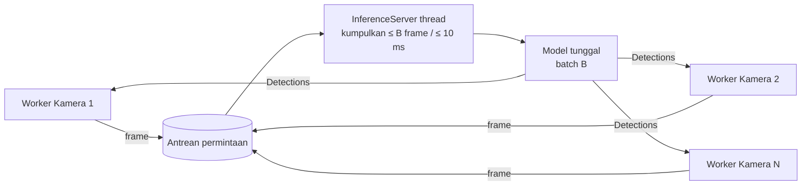

# FASE 8 — Optimasi Kinerja & Packaging (Installer Desktop)

> Sebelumnya: [FASE-07](FASE-07-profil-konfigurasi-template.md) · Kembali ke [Roadmap](00-ROADMAP.md) · Berikutnya: [FASE-09 Pengujian & Evaluasi](FASE-09-pengujian-evaluasi.md)
> Referensi Proposal: **§3** (“analitik real-time bisa berjalan di PC/edge device berbiaya wajar”), **§4 RM-4** (throughput FPS pada perangkat kelas menengah), **§7** (YOLOv11/RT-DETR, VLM opsional), **§10** (target ≥ 20 FPS di RTX 3060; skalabilitas kamera per node), **§8.5** (VLM sebagai fitur premium)
> Estimasi: **2–3 minggu** · Milestone: **M5** (bagian 1)

---

## 1. Tujuan

1. **Mengukur** (profiling) lalu **mengoptimasi** pipeline sehingga memenuhi target Proposal §10 dan dapat menangani **beberapa kamera** per PC.
2. Menyediakan backend inferensi alternatif: **ONNX Runtime** (CPU/GPU), **TensorRT FP16** (NVIDIA), **OpenVINO** (CPU/iGPU Intel).
3. **Inferensi terpusat + batching** untuk multi-kamera (hemat VRAM & lebih efisien daripada 1 model per kamera).
4. **Packaging**: installer Windows & Linux yang bisa dipasang pengguna awam, termasuk varian ringan **tanpa PyTorch**.
5. Kesiapan operasional: logging, auto-start, watchdog, *soak test*.

## 2. Profiling Dahulu, Optimasi Kemudian

`Pipeline.times` (Fase 3) sudah mencatat waktu per tahap. Tambahkan pencatatan **decode** (di source) dan **render/emit** (di worker), lalu buat skrip `scripts/benchmark.py` yang menjalankan N frame dan menulis tabel:

| Tahap | ms/frame (median) | % total |
|---|---|---|
| Decode RTSP/file | | |
| Pra-proses + inferensi | | |
| Tracking | | |
| Analitik (zona, garis, heatmap) | | |
| Anotasi + konversi QImage | | |
| **Total / FPS efektif** | | |

Alat bantu: `py-spy top --pid <PID>` (tanpa ubah kode), `nvidia-smi dmon`, `psutil` untuk CPU/RAM.

## 3. Matriks Eksperimen Optimasi

| Teknik | Variasi | Ekspektasi | Catat |
|---|---|---|---|
| Ukuran model | yolo11n / s / m | n tercepat, m paling akurat | FPS, mAP (Fase 9) |
| Resolusi input | imgsz 640 / 480 / 320 | ~2× lebih cepat per turunnya resolusi, akurasi orang jauh turun | FPS, recall |
| Backend | PyTorch / ONNX Runtime / TensorRT FP16 / OpenVINO | TensorRT tercepat di NVIDIA; OpenVINO terbaik di CPU Intel | FPS, ukuran paket |
| Stream | main vs sub | sub jauh lebih ringan (decode + resize) | FPS, recall |
| Frame stride | inferensi tiap 1 / 2 / 3 frame | FPS naik, tracking bisa turun | ID switch |
| Batching multi-kamera | 1 model/kamera vs 1 model batch N | VRAM turun, throughput total naik | FPS per kamera, VRAM |
| HW decode | off / on (`CAP_PROP_HW_ACCELERATION`) | CPU turun untuk H.265 | CPU % |

Setiap baris diuji pada **≥2 kelas perangkat** (mis. laptop tanpa GPU diskrit & PC RTX 3060) → tabel ini menjawab **RM-4**.

## 4. Implementasi

### 4.1 Ekspor model

```python
from ultralytics import YOLO

m = YOLO("models/yolo11n.pt")
m.export(format="onnx", imgsz=640, simplify=True, dynamic=False)   # -> yolo11n.onnx
m.export(format="engine", imgsz=640, half=True)                    # TensorRT (butuh GPU NVIDIA + TensorRT)
m.export(format="openvino", imgsz=640, half=False)                 # -> yolo11n_openvino_model/
```

> File `.engine` TensorRT **terikat GPU & versi TensorRT** di mesin tempat dibuat → buat saat instalasi/first-run di PC pengguna, bukan dibawa di installer.

Ultralytics dapat memuat langsung `YOLO("yolo11n.onnx")`, `YOLO("yolo11n.engine")`, `YOLO("yolo11n_openvino_model/")` — sehingga `Detector` Fase 2 cukup menerima path berbeda.

### 4.2 Detector ONNX murni (tanpa PyTorch) — `aio_cctv/inference/onnx_detector.py`

Untuk build ringan: `onnxruntime` (~50 MB) menggantikan `torch` + `ultralytics` (> 1 GB). Pra/pasca-proses ditulis sendiri:

```python
import cv2
import numpy as np
import onnxruntime as ort
import supervision as sv


def letterbox(img: np.ndarray, size: int):
    h, w = img.shape[:2]
    r = min(size / h, size / w)
    nw, nh = int(round(w * r)), int(round(h * r))
    canvas = np.full((size, size, 3), 114, dtype=np.uint8)
    top, left = (size - nh) // 2, (size - nw) // 2
    canvas[top:top + nh, left:left + nw] = cv2.resize(img, (nw, nh), interpolation=cv2.INTER_LINEAR)
    return canvas, r, left, top


class OnnxDetector:
    """YOLO11 ONNX: output (1, 4 + n_kelas, N) — cx, cy, w, h + skor kelas (tanpa objectness)."""

    def __init__(self, path: str, class_ids=(0,), conf: float = 0.35, iou: float = 0.5,
                 imgsz: int = 640, providers=None):
        self.sess = ort.InferenceSession(
            path, providers=providers or ["CUDAExecutionProvider", "CPUExecutionProvider"])
        self.inp = self.sess.get_inputs()[0].name
        self.class_ids = np.array(class_ids)
        self.conf, self.iou, self.imgsz = conf, iou, imgsz

    def __call__(self, frame: np.ndarray) -> sv.Detections:
        img, r, left, top = letterbox(frame, self.imgsz)
        blob = cv2.cvtColor(img, cv2.COLOR_BGR2RGB).transpose(2, 0, 1)[None].astype(np.float32) / 255.0
        pred = self.sess.run(None, {self.inp: blob})[0][0].T          # (N, 4 + n_kelas)

        cls_scores = pred[:, 4:][:, self.class_ids]
        best = cls_scores.argmax(axis=1)
        scores = cls_scores[np.arange(len(pred)), best]
        keep = scores > self.conf
        if not keep.any():
            return sv.Detections.empty()
        boxes, scores, cls = pred[keep, :4], scores[keep], self.class_ids[best[keep]]

        # cx,cy,w,h (ruang letterbox) -> x1,y1,x2,y2 (ruang frame asli)
        xyxy = np.empty_like(boxes)
        xyxy[:, 0] = (boxes[:, 0] - boxes[:, 2] / 2 - left) / r
        xyxy[:, 1] = (boxes[:, 1] - boxes[:, 3] / 2 - top) / r
        xyxy[:, 2] = (boxes[:, 0] + boxes[:, 2] / 2 - left) / r
        xyxy[:, 3] = (boxes[:, 1] + boxes[:, 3] / 2 - top) / r
        h, w = frame.shape[:2]
        xyxy[:, [0, 2]] = xyxy[:, [0, 2]].clip(0, w - 1)
        xyxy[:, [1, 3]] = xyxy[:, [1, 3]].clip(0, h - 1)

        xywh = np.c_[xyxy[:, :2], xyxy[:, 2:] - xyxy[:, :2]]
        idx = cv2.dnn.NMSBoxes(xywh.tolist(), scores.tolist(), self.conf, self.iou)
        idx = np.array(idx).flatten().astype(int)
        return sv.Detections(xyxy=xyxy[idx].astype(np.float32), confidence=scores[idx].astype(np.float32),
                             class_id=cls[idx].astype(int))
```

Validasi: jumlah & posisi kotak `OnnxDetector` vs `Detector` (Ultralytics) pada 100 frame harus hampir identik (IoU rata-rata > 0.95). Masukkan sebagai unit test.

### 4.3 Inferensi terpusat & batching — `aio_cctv/inference/server.py`



```python
import queue
import threading
from concurrent.futures import Future


class InferenceServer(threading.Thread):
    def __init__(self, model, max_batch: int = 8, max_wait_s: float = 0.01):
        super().__init__(name="inference", daemon=True)
        self.model, self.max_batch, self.max_wait_s = model, max_batch, max_wait_s
        self.q: queue.Queue = queue.Queue()
        self._stop = threading.Event()

    def submit(self, frame) -> Future:
        fut: Future = Future()
        self.q.put((frame, fut))
        return fut

    def run(self) -> None:
        while not self._stop.is_set():
            try:
                items = [self.q.get(timeout=0.1)]
            except queue.Empty:
                continue
            try:
                while len(items) < self.max_batch:
                    items.append(self.q.get(timeout=self.max_wait_s))
            except queue.Empty:
                pass
            frames = [f for f, _ in items]
            try:
                results = self.model.detect_batch(frames)     # Ultralytics menerima list frame
                for (_, fut), det in zip(items, results):
                    fut.set_result(det)
            except Exception as e:
                for _, fut in items:
                    fut.set_exception(e)

    def stop(self) -> None:
        self._stop.set()
```

Worker kamera memanggil `server.submit(frame).result()`; **tracker & engine tetap per kamera** (state tracking tidak boleh tercampur).

> Tambahkan `detect_batch(frames)` pada `Detector`: `self.model(frames, ...)` lalu `[sv.Detections.from_ultralytics(r) for r in results]`.

### 4.4 Strategi adaptif

- **Auto-select backend** saat first-run: TensorRT jika NVIDIA + TensorRT tersedia → ONNX CUDA → OpenVINO (CPU Intel) → ONNX CPU.
- **Auto-tune**: bila FPS proses < FPS target, turunkan imgsz / aktifkan stride; tampilkan di status bar.
- **Frame stride & ByteTrack**: bila inferensi tiap *k* frame, set `frame_rate` tracker = `fps / k` agar buffer lost-track tetap benar dalam detik.

### 4.5 (Opsional) VLM reasoning — Proposal §7 & §8.5

Hanya bila semua target lain tercapai. Contoh fitur: tombol “Jelaskan kondisi” pada snapshot → model VLM lokal kecil (mis. Qwen2.5-VL 3B via Ollama/llama.cpp) → teks “Meja 3 kosong, ada gelas tertinggal”. Dijalankan **on-demand**, bukan per frame. Diposisikan sebagai **pengembangan lanjut** di Bab V bila tidak sempat.

## 5. Packaging

### 5.1 Varian distribusi

| Varian | Isi | Ukuran perkiraan | Target |
|---|---|---|---|
| **Lite** | PyQt6 + OpenCV headless + onnxruntime (CPU/DirectML) + `yolo11n.onnx` | ± 200–300 MB | PC tanpa GPU NVIDIA |
| **GPU** | + onnxruntime-gpu atau PyTorch CUDA / TensorRT | ± 1.5–3 GB | PC dengan GPU NVIDIA |

### 5.2 PyInstaller (mode *one-folder*)

`one-folder`, bukan `one-file` (one-file mengekstrak ratusan MB ke temp setiap start → lambat).

```bash
pip install pyinstaller
pyinstaller main.py --name AIO-CCTV --windowed --noconfirm \
  --add-data "configs:configs" --add-data "models/yolo11n.onnx:models" \
  --add-data "aio_cctv/storage/schema.sql:aio_cctv/storage" \
  --collect-submodules aio_cctv --icon assets/icon.ico
```

(Pada Windows pemisah `--add-data` adalah `;`.) Alternatif: **Nuitka** (`--standalone --enable-plugin=pyqt6`) → start lebih cepat, build lebih lama.

Path resource harus kompatibel dengan mode beku:

```python
import sys
from pathlib import Path

BASE = Path(getattr(sys, "_MEIPASS", Path(__file__).resolve().parents[2]))
```

### 5.3 Installer

- **Windows:** Inno Setup → `AIO-CCTV-Setup-x.y.z.exe`; shortcut Start Menu, opsi *jalankan saat Windows start*, uninstaller (tidak menghapus data pengguna kecuali dipilih). Tambahkan aturan firewall untuk discovery ONVIF (UDP 3702) bila perlu.
- **Linux:** AppImage (paling portabel) atau `.deb`; file `.desktop` + autostart di `~/.config/autostart/`.
- **Pengujian installer** di mesin/VM bersih (tanpa Python).

### 5.4 Kesiapan operasional

| Aspek | Implementasi |
|---|---|
| Logging | `logging.handlers.RotatingFileHandler` di `APP_DIR/logs`, 5 × 5 MB; password dimask (Fase 4) |
| Crash handler | `sys.excepthook` → simpan traceback + tampilkan dialog “kirim log ke pengembang (manual)” |
| Watchdog | Timer di `CameraManager`: worker tanpa frame > 30 s → restart worker |
| Auto-start & tray | Minimize ke tray, tetap berjalan analitik di latar belakang |
| Versi | `aio_cctv.__version__`, SemVer, `CHANGELOG.md`, tampil di menu Tentang |
| Konfigurasi hilang/rusak | Validasi Pydantic + backup otomatis profil sebelum disimpan |

### 5.5 Soak test

Jalankan build rilis **24–72 jam** dengan 4 kamera: catat tiap menit RSS memori, VRAM, CPU/GPU %, FPS per kamera, jumlah reconnect (tabel `camera_health` Fase 6 sudah merekam sebagian). Target: memori stabil (tidak naik monoton), tidak ada crash.

## 6. Keluaran (Deliverables)

| Keluaran | Lokasi |
|---|---|
| `benchmark.py` + tabel profiling sebelum/sesudah | `scripts/`, `docs/logbook/` |
| `OnnxDetector`, `InferenceServer`, auto-select backend | `aio_cctv/inference/` |
| Matriks eksperimen optimasi (≥2 perangkat) | `docs/logbook/` (bahan RM-4) |
| Installer Windows & AppImage Linux | `dist/` (rilis GitHub) |
| Grafik soak test | `docs/logbook/` |

## 7. Definition of Done

- [ ] Target **≥ 20 FPS** (Proposal §10) tercapai di GPU kelas menengah untuk 1 kamera; jumlah kamera maksimum per perangkat terdokumentasi.
- [ ] Build Lite berjalan di PC tanpa Python & tanpa GPU.
- [ ] Soak test 24 jam lulus.
- [ ] Tag `v1.0.0-rc1`.

## 8. Risiko & Mitigasi

| Risiko | Mitigasi |
|---|---|
| Antivirus menandai exe PyInstaller (false positive) | Gunakan Nuitka / tanda tangan kode bila ada; laporkan false positive |
| Versi CUDA/TensorRT tidak cocok di PC pengguna | Default ke ONNX Runtime; TensorRT sebagai opsi lanjutan |
| Perbedaan hasil ONNX vs PyTorch | Unit test pembanding (§4.2) |
| Ukuran installer terlalu besar | Varian Lite; unduh model saat first-run |
