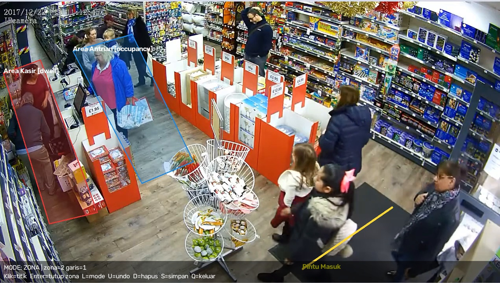
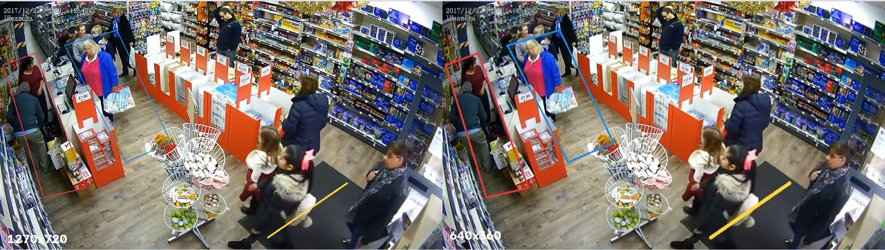

# Logbook — 19 September 2026 (Fase 1)

> **Fase:** 1 — Marker Area: Editor Zona & Garis ([FASE-01](../fase/FASE-01-marker-area-zona.md))
> **Referensi Proposal:** §8.4 (konfigurasi JSON per tenant), §8.5 (editor zona visual), §4 RM-3 (konfigurasi tanpa ubah kode), §1 (konfigurasi zona & aturan)
> **Logbook sebelumnya:** [2026-09-19 — Fase 0](2026-09-19.md)
> **Status fase:** Fungsi utama selesai dan terverifikasi. Tiga perapian kecil dan dua deliverable masih terbuka (lihat §6).

---

## 1. Ringkasan Kegiatan

1. Membuat skema profil v1 (Pydantic) di `aio_cctv/zones/models.py`. Skema ini berisi `Profile`, `Zone`, `Line`, `SourceConfig`, serta fungsi konversi `to_pixels` dan `to_normalized` untuk koordinat ternormalisasi 0..1.
2. Membuat helper warna `aio_cctv/core/colors.py` (`hex_to_bgr`, `PALETTE`).
3. Membuat editor marker area berbasis OpenCV di `aio_cctv/zones/editor_cv.py`. Editor punya mode zona dan garis, serta fungsi undo, hapus, simpan, dan pilih frame acuan (`--time`).
4. Membuat viewer overlay `aio_cctv/zones/viewer_cv.py` yang memutar video dengan zona dari file JSON.
5. Menulis unit test `tests/test_zone_models.py` (4 kasus).
6. Menggambar profil `configs/profiles/demo_ref1.json` untuk video `ref1`.
7. Membuat `data/videos/ref1_360p.mp4` (640×360) untuk menguji bahwa zona tetap tepat di resolusi lain.
8. Revisi setelah pemeriksaan pertama:
   - mengembalikan `__init__.py` di `core/` dan `zones/` yang sempat terhapus,
   - memperluas zona sampai ke lantai (area kaki),
   - menambah garis hitung "Pintu Masuk".

## 2. Berkas yang Dihasilkan

| Berkas | Keterangan |
|---|---|
| `aio_cctv/zones/models.py` | Skema profil v1 + konversi koordinat |
| `aio_cctv/core/colors.py` | Helper warna |
| `aio_cctv/zones/editor_cv.py` | Editor marker area (OpenCV) |
| `aio_cctv/zones/viewer_cv.py` | Viewer overlay |
| `tests/test_zone_models.py` | Unit test skema & konversi |
| `configs/profiles/demo_ref1.json` | Profil video `ref1` |
| `docs/logbook/img/fase1-*.jpg` | Screenshot untuk laporan |

## 3. Isi Profil `demo_ref1`

Sumber: `data/videos/ref1.mp4`, frame acuan 1270×720.

| ID | Nama | Jenis | Tipe | Jumlah titik | Keterangan |
|---|---|---|---|---|---|
| z1 | Area Kasir | zona | `dwell` | 5 | Lantai di balik dan di depan meja kasir (kiri) |
| z2 | Area Antrian | zona | `occupancy` | 5 | Lantai di depan meja kasir, tempat pelanggan mengantre |
| l1 | Pintu Masuk | garis | `counting` | 2 | Melintang di keset pintu (kanan bawah) |

*Gambar 1. Tampilan editor marker area dengan 2 zona dan 1 garis pada `ref1` (detik ke-5). Teks bantuan berada di bawah frame.*

## 4. Hasil Verifikasi

| Uji | Hasil |
|---|---|
| `pytest` (`tests/test_zone_models.py`) | ✅ 4/4 lulus: simpan-muat JSON, tolak poligon < 3 titik, tolak koordinat > 1, konversi tidak bergantung resolusi |
| Profil `demo_ref1.json` dimuat ulang oleh `Profile.load` | ✅ Valid |
| Overlay pada `ref1.mp4` (1270×720) dan `ref1_360p.mp4` (640×360) | ✅ Posisi zona dan garis identik (Gambar 2), jadi normalisasi koordinat terbukti bekerja |
| Import modul dari luar folder repo | ✅ Setelah `__init__.py` dikembalikan, `aio_cctv.core` dan `aio_cctv.zones` kembali menjadi paket biasa |
| `ruff check` | ⚠️ 1 peringatan kecil (lihat §6) |

*Gambar 2. Profil yang sama digambar di atas video 1270×720 (kiri) dan 640×360 (kanan).*

## 5. Masalah & Solusi

| # | Masalah | Penyebab | Solusi | Status |
|---|---|---|---|---|
| 1 | `aio_cctv/core/__init__.py` dan `aio_cctv/zones/__init__.py` terhapus | Berkas ikut terhapus saat pengerjaan | Dikembalikan dari git. Tanpa file ini, folder hanya dianggap *namespace package*: import masih jalan, tapi rawan gagal saat packaging di Fase 8. | Selesai |
| 2 | Batas bawah zona hanya menutupi badan orang dan rak, belum sampai lantai | Zona digambar mengikuti tubuh orang | Zona diperluas ke bawah sampai area lantai. Keanggotaan zona ditentukan oleh **titik kaki** (bawah-tengah bounding box). | Selesai |
| 3 | Profil belum punya garis hitung | Belum digambar | Garis "Pintu Masuk" ditambahkan dengan mode `L` | Selesai |
| 4 | Titik terakhir tiap poligon hampir sama dengan titik pertama, misalnya (0.0071, 0.2587) dan (0.0063, 0.2573) | Titik awal diklik lagi untuk "menutup" poligon | Tidak perlu diklik lagi, karena Enter sudah otomatis menutup poligon. Dampaknya kecil (hanya ada titik ganda). | Terbuka (perapian) |
| 5 | Teks bantuan editor bertumpuk dengan timestamp bawaan CCTV di pojok kiri atas | Teks digambar di y = 25–47 px, area yang sama dengan timestamp CCTV | Teks dipindah ke bagian bawah frame dengan latar hitam semi-transparan (`ZoneEditor.render`) | Selesai |
| 6 | Teks bantuan tampak dobel ("garis=1 1", "keluar eluar") | Di OpenCV 5, lebar huruf `putText` berubah sesuai *thickness*, sehingga outline hitam (thickness 3) tidak sejajar dengan teks putih (thickness 1) | Outline dihapus. Teks putih dengan anti-aliasing (`LINE_AA`) di atas latar gelap. | Selesai |

**Pelajaran:** orang dianggap berada di dalam zona berdasarkan posisi kakinya. Karena itu zona harus digambar di **lantai**, bukan di area badan orang atau rak.

## 6. Checklist Definition of Done (FASE-01 §6)

- [x] Dapat menggambar ≥ 2 zona dan ≥ 1 garis, lalu menyimpannya ke JSON.
- [x] JSON rusak (poligon 2 titik, koordinat > 1) ditolak dengan pesan jelas (dibuktikan unit test).
- [x] Overlay tepat di video resolusi asli **dan** hasil resize.
- [x] `pytest` lulus semua.
- [ ] Tag `v0.1-zone-editor` belum dibuat.

**Perapian yang masih terbuka:**

| Item | Tindakan |
|---|---|
| `"vertical": "fnb"` di `demo_ref1.json`, padahal scene `ref1` adalah ritel | Ganti menjadi `"retail"` |
| Titik penutup ganda di z1 dan z2 | Hapus titik terakhir di JSON, atau gambar ulang dan tutup dengan Enter |
| Peringatan ruff UP037 di `models.py:65` (`-> "Profile"`) | `ruff check --fix aio_cctv` |
| Deliverable ≥ 3 profil untuk 3 video | Menunggu tambahan video uji (masih terbuka dari Fase 0) |

## 7. Catatan untuk Laporan TA

- **Bab III (perancangan):** buat diagram kelas `Profile – Zone – Line – SourceConfig` dan jelaskan alasan memakai **koordinat ternormalisasi**. Contoh JSON di Proposal §8.4 memakai koordinat piksel. Koordinat ternormalisasi dipilih agar satu profil berlaku untuk *main-stream* dan *sub-stream* kamera IP (Fase 4).
- **Bab IV (implementasi):** gunakan Gambar 1 dan Gambar 2. Gambar 2 menjadi bukti bahwa normalisasi koordinat bekerja.
- **Kaitan RM-3 (Proposal §4):** perilaku analitik ditentukan oleh berkas profil, bukan oleh kode.

## 8. Rencana Berikutnya

1. Selesaikan perapian di §6 lalu buat tag `v0.1-zone-editor`. Push ke GitHub **ditunda** sesuai permintaan.
2. Tambah minimal 2 video uji (cek codec H.264) beserta profilnya.
3. Mulai **Fase 2: Deteksi Sederhana**. Buat `aio_cctv/inference/detector.py` dan `scripts/detect_zones.py`, lalu uji dengan `demo_ref1.json`.
