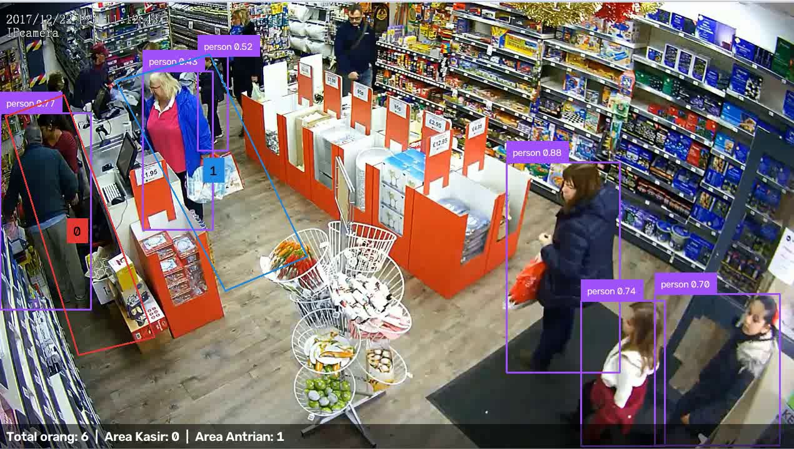
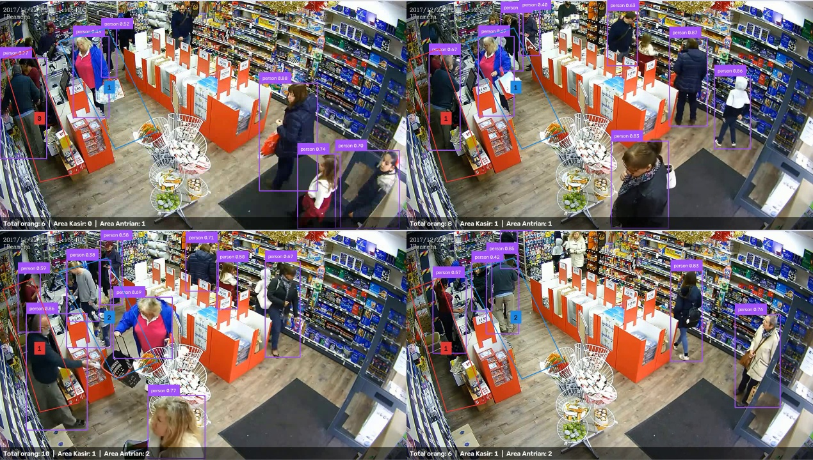

# Logbook — 19 September 2026 (Fase 2)

> **Fase:** 2 — Deteksi Sederhana pada Video YouTube ([FASE-02](../fase/FASE-02-deteksi-sederhana-video-youtube.md))
> **Referensi Proposal:** §8.2 (skrip inti, bagian deteksi), §7 (YOLOv11 — "Apakah YOLO cukup?"), §2 (video referensi), §5 (objek utama *person*), §13 (YOLO pretrained COCO)
> **Logbook sebelumnya:** [2026-09-19 — Fase 1](2026-09-19-fase-01.md)
> **Status fase:** Pipeline deteksi dan penghitungan per zona **berfungsi** untuk seluruh video `ref1`. Benchmark n/s/m **selesai** (§3.3). Sanity check dan demo M1 **belum dikerjakan** (lihat §7).

---

## 1. Ringkasan Kegiatan

1. Membuat kelas `Detector` di `aio_cctv/inference/detector.py`, pembungkus YOLOv11 Ultralytics. Filter kelas dilakukan di dalam model (`classes=[0]`, *person*). Ada fungsi `warmup()`, dan backend dapat diganti di Fase 8.
2. Membuat CLI MVP `scripts/detect_zones.py` yang membaca video dan profil, lalu menghasilkan video beranotasi, CSV jumlah orang per zona per detik, dan `summary.json`.
3. Membuat `scripts/compare_models.py` untuk membandingkan yolo11n/s/m pada imgsz 640 dan 480. Bobot `yolo11s.pt` dan `yolo11m.pt` diunduh ke `models/`, lalu benchmark dijalankan 2× (§3.3).
4. Menjalankan deteksi pada seluruh video `ref1` (1452 frame).
5. Menambahkan `outputs/` ke `.gitignore`, karena video hasil berukuran ±100 MB.
6. Memperbaiki posisi teks ringkasan pada video hasil. Detailnya ada di §5 no. 2.

## 2. Konfigurasi Uji

| Parameter | Nilai |
|---|---|
| Video | `data/videos/ref1.mp4`: ritel, 1270×720, 13,09 fps, 1452 frame (1 m 51 s), H.264 |
| Profil | `configs/profiles/demo_ref1.json`: zona *Area Kasir* (dwell), *Area Antrian* (occupancy), garis *Pintu Masuk* |
| Model | `models/yolo11n.pt` (COCO pretrained, tanpa fine-tuning) |
| imgsz / conf / iou | 640 / 0.35 / 0.5 |
| Anchor zona | `BOTTOM_CENTER` (titik kaki) |
| Perangkat | RTX 5060 8 GB, Ryzen 5 5600 (lihat [logbook Fase 0](2026-09-19.md) §2) |

## 3. Hasil

### 3.1 `summary.json`

| Metrik | Nilai |
|---|---|
| Frame diproses | 1452 (seluruh video) |
| Rata-rata waktu inferensi | **7,65 ms/frame** |
| FPS inferensi | **± 131 FPS**, jauh di atas target Proposal §10 (≥ 20 FPS) |
| Maksimum orang: *Area Kasir* | 2 |
| Maksimum orang: *Area Antrian* | 5 |

> FPS di atas adalah **waktu inferensi saja**. Waktu decode video, anotasi, dan penulisan file belum termasuk. FPS keseluruhan pipeline akan diukur di Fase 8.

### 3.2 Statistik `counts_per_second.csv` (112 sampel, 1 per detik)

| Kolom | Rata-rata | Min | Maks | Detik dengan ≥ 1 orang |
|---|---|---|---|---|
| Total orang di frame | 7,62 | 5 | 12 | 112 / 112 |
| Area Kasir | 0,96 | 0 | 2 | 100 / 112 |
| Area Antrian | 1,63 | 0 | 4 | 106 / 112 |

> Maksimum *Area Antrian* di CSV adalah 4, sedangkan di `summary.json` 5. Perbedaan ini wajar: CSV hanya mengambil 1 frame per detik, sedangkan `summary.json` memeriksa setiap frame.

### 3.3 Benchmark Model yolo11n / s / m

Setup: `scripts/compare_models.py`, **300 frame pertama** `ref1` (±23 detik), RTX 5060, PyTorch FP32, 1 frame per panggilan (tanpa batch). Pengukuran dijalankan 2× dan hasilnya konsisten (selisih ≤ 0,3 ms). Log mentah ada di `outputs/benchmark/compare_models_run{1,2}.txt`.

| Model | Ukuran bobot | imgsz | ms/frame (run 1 / run 2) | FPS (rata-rata) | Rata-rata deteksi *person* per frame |
|---|---|---|---|---|---|
| yolo11n | 5,6 MB | 640 | 6,8 / 7,0 | ± 145 | 8,10 |
| yolo11n | | 480 | 6,5 / 6,5 | ± 154 | 6,31 |
| yolo11s | 19,3 MB | 640 | 6,8 / 7,1 | ± 144 | **11,04** |
| yolo11s | | 480 | 6,7 / 6,7 | ± 149 | 9,51 |
| yolo11m | 40,7 MB | 640 | 8,1 / 8,4 | ± 121 | 10,42 |
| yolo11m | | 480 | 8,5 / 8,2 | ± 120 | 7,85 |

Rincian waktu per tahap Ultralytics (100 frame, imgsz 640):

| Model | Pra-proses | Inferensi | Pasca-proses |
|---|---|---|---|
| yolo11n | 0,77 ms | 5,02 ms | 0,98 ms |
| yolo11m | 0,77 ms | 6,41 ms | 0,78 ms |

**Analisis:**

1. **Di GPU, ukuran model hampir tidak memengaruhi kecepatan.** yolo11m punya ±7× lebih banyak bobot daripada yolo11n, tetapi hanya ±1,3 ms lebih lambat. Waktu per frame didominasi *overhead* tetap: peluncuran kernel CUDA, pra/pasca-proses, dan overhead Python. Komputasi modelnya sendiri kecil untuk GPU ini. Menurunkan imgsz ke 480 juga hanya menghemat ±0,3 ms.
2. **Resolusi 480 mengurangi deteksi secara nyata** (n: −22%, s: −14%, m: −25%). Orang yang jauh atau kecil di frame hilang, sementara penghematan waktunya tidak berarti. **Di GPU tidak ada alasan memakai 480.**
3. **yolo11s @640 mendeteksi 36% lebih banyak orang dibanding yolo11n** (11,04 vs 8,10), dengan kecepatan yang praktis sama. Kemungkinan tambahan itu adalah orang yang berdempetan atau jauh di lorong (lihat §4, conf 0,40–0,52).
4. **"Rata-rata deteksi" bukan ukuran akurasi.** Angka yang lebih tinggi bisa berarti lebih banyak *true positive*, tetapi bisa juga *false positive* atau kotak ganda. yolo11m justru mendeteksi lebih sedikit daripada yolo11s. Tanpa ground truth, belum bisa disimpulkan mana yang paling akurat. Hal ini dijawab oleh sanity check (§7) dan evaluasi mAP di Fase 9.

**Keputusan sementara untuk Fase 3:** gunakan **yolo11s, imgsz 640** sebagai model default di GPU. Kecepatannya setara yolo11n, dan jumlah deteksinya lebih banyak. yolo11n tetap disiapkan untuk PC tanpa GPU (dibahas di Fase 8). Keputusan ini akan dikonfirmasi setelah sanity check MAE.

*Gambar 1. Frame pertama `annotated.mp4`: kotak deteksi orang, jumlah per zona, dan ringkasan di bawah frame.*

*Gambar 2. Sampel frame ke-0, 195, 700, dan 1300.*

## 4. Pengamatan Kualitatif

| Pengamatan | Penjelasan | Dampak / tindak lanjut |
|---|---|---|
| Deteksi orang berdiri di lorong dan pintu stabil (conf 0,70–0,88) | Sudut kamera miring dari atas, orang terlihat utuh | Sudah baik untuk Fase 3 (tracking) |
| **Pelanggan di depan kasir terlewat oleh *Area Kasir*** (frame 0: sistem 0, visual 1) | Titik kaki pria berada di (≈72, 495) px, sedangkan sisi kiri zona merah miring ke kanan (x ≈ 102 px pada y = 495). Titik kaki jatuh **di luar** poligon. | **Perbaiki zona:** tarik sudut kiri-bawah *Area Kasir* sampai tepi kiri frame (x = 0) |
| **Kasir di balik meja tidak terdeteksi / tidak terhitung** | Badan bagian bawah tertutup meja kasir (*occlusion*), sehingga titik kaki tidak terlihat | Keterbatasan kamera. Opsi di Fase 7: anchor `center` untuk zona staf. Bahan pembahasan RM-2 (Proposal §4). |
| Beberapa orang berdempetan di lorong kiri atas terdeteksi dengan conf rendah (0,40–0,52) | Orang saling menutupi dan jaraknya jauh dari kamera | Dievaluasi di sanity check, dan nanti dengan model s/m |

## 5. Masalah & Solusi

| # | Masalah | Penyebab | Solusi | Status |
|---|---|---|---|---|
| 1 | Hasil awal hanya 399 dari 1452 frame | Jendela `--show` ditutup dengan `q` sebelum video selesai | Dijalankan ulang tanpa `--show` → 1452 frame | Selesai |
| 2 | Teks "Total orang" menimpa timestamp bawaan CCTV di kiri atas | Teks digambar di (10, 30) px | Ringkasan dipindah ke bawah frame dengan latar hitam semi-transparan. Isinya kini juga jumlah per zona: `Total orang: N \| Area Kasir: x \| Area Antrian: y`. | Selesai |
| 3 | Video hasil (±100 MB) berisiko ikut ter-commit | `outputs/` belum di-*ignore* | `outputs/` ditambahkan ke `.gitignore` | Selesai |
| 4 | Zona *Area Kasir* tidak mencakup pelanggan di dekat dinding kiri | Geometri poligon (lihat §4) | Edit zona dengan editor Fase 1 | **Terbuka** |

## 6. Catatan Teknis

- Video hasil memakai codec **MPEG-4 Part 2** (`mp4v`, default Supervision). Video ini bisa diputar di VLC, tetapi tidak di browser atau GitHub. Untuk demo, konversi dulu: `ffmpeg -i annotated.mp4 -c:v libx264 -crf 23 annotated_h264.mp4`.
- Ruff masih memberi 3 peringatan minor di `detect_zones.py`: `open()` tanpa `with` (SIM115), dan dua `int()` yang tidak perlu (RUF046). Fungsinya tidak terpengaruh.

## 7. Checklist Definition of Done (FASE-02 §7)

- [x] Satu perintah menghasilkan video beranotasi dengan jumlah orang per zona.
- [x] CSV dan `summary.json` terbentuk (seluruh video).
- [x] Benchmark n/s/m tercatat, dan model default fase berikutnya dipilih beserta alasannya (§3.3).
- [ ] **Sanity check MAE** pada ≥ 3 video: hitung manual 20 frame per video, lalu bandingkan dengan CSV. Video uji masih 1.
- [ ] **Demo M1** (`docs/demo/m1.mp4`): rekam layar editor zona, lalu deteksi berjalan.
- [ ] Tag `v0.2-mvp-detection`. Tag `v0.1-zone-editor` dari Fase 1 juga belum dibuat.

## 8. Catatan untuk Laporan TA

- **Bab IV:** gunakan Gambar 1 dan tabel §3 sebagai bukti MVP (target awal proyek, Milestone M1).
- **RM-4 (Proposal §4):** angka awal 7,65 ms/frame (yolo11n, 640, RTX 5060) menjadi *baseline* sebelum optimasi di Fase 8. Tabel §3.3 menunjukkan bahwa di GPU kelas menengah bottleneck-nya adalah *overhead*, bukan ukuran model. Temuan ini mengarahkan optimasi Fase 8 ke *batching* multi-kamera dan TensorRT, bukan ke pengecilan model.
- **RM-2:** kasus kasir yang tertutup meja adalah contoh nyata *occlusion*. Kasus pelanggan di tepi zona menunjukkan bahwa **hasil analitik sangat bergantung pada kualitas penggambaran zona**. Ini juga argumen perlunya editor zona visual dengan pratinjau deteksi (Fase 5 §5.6).

## 9. Rencana Berikutnya

1. Perbaiki poligon *Area Kasir*, jalankan ulang `detect_zones.py`, dan bandingkan hasilnya.
2. ~~Jalankan benchmark n/s/m~~ ✅ Selesai: yolo11s @640 dipilih sementara (§3.3).
3. Tambah 2 video uji, lalu lakukan sanity check MAE.
4. Rekam demo M1, commit, lalu buat tag `v0.1-zone-editor` dan `v0.2-mvp-detection`. Push ke GitHub **ditunda** sesuai permintaan.
5. Mulai **Fase 3: Tracking & Analytics Engine**.
