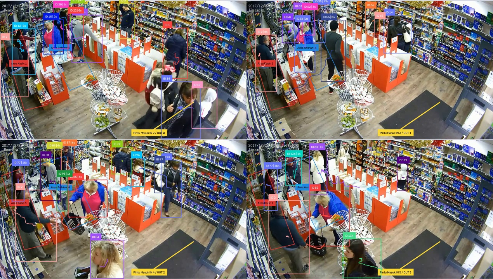
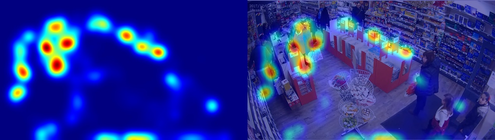

# Logbook — 19 September 2026 (Fase 3)

> **Fase:** 3 — Multi-Object Tracking & Analytics Engine Inti ([FASE-03](../fase/FASE-03-tracking-analitik-inti.md))
> **Referensi Proposal:** §1 (kemampuan dasar), §6 (Analytics Engine digerakkan konfigurasi), §7 (ByteTrack, BoT-SORT, Supervision), §8.2 (dwell time + heatmap), §8.5 (line counter), §4 RM-1 & RM-2
> **Logbook sebelumnya:** [2026-09-19 — Fase 2](2026-09-19-fase-02.md)
> **Status fase:** Engine analitik (tracking, dwell, line crossing, okupansi, heatmap) **berfungsi** untuk seluruh video `ref1`. Tiga perbaikan dari hasil review sudah diterapkan (§5). Tuning dwell/ID, validasi manual garis, perbaikan zona/garis, dan demo M2 **belum selesai** (§7).

---

## 1. Ringkasan Kegiatan

1. Mengimplementasikan seluruh modul Fase 3 sesuai dokumen:

   | Kelompok | Berkas |
   |---|---|
   | Sumber video | `sources/base.py`, `sources/file_source.py` |
   | Tracking | `tracking/tracker.py` |
   | Analitik | `analytics/events.py`, `analytics/dwell.py`, `analytics/lines.py`, `analytics/heatmap.py`, `analytics/engine.py`, `analytics/annotate.py` |
   | Perakit | `pipeline.py` |
   | CLI | `scripts/run_analytics.py` |

2. Menulis unit test dwell (`tests/test_dwell.py`, 2 kasus).
3. Review dan perbaikan:
   - menambah tracker BoT-SORT yang terlewat,
   - memberi opsi `--model` dengan default yolo11s,
   - memperbaiki hitungan "kedip" di line counter, lengkap dengan unit test (`tests/test_lines.py`, 4 kasus).
4. Membuat `scripts/compare_trackers.py` untuk membandingkan ByteTrack dan BoT-SORT.
5. Menambah dependensi `lap>=0.5.12` di `pyproject.toml`, karena dibutuhkan BoT-SORT.
6. Menjalankan analitik lengkap pada `ref1` (1452/1452 frame).

## 2. Konfigurasi Uji

| Parameter | Nilai |
|---|---|
| Video | `data/videos/ref1.mp4`: ritel, 1270×720, 13,09 fps, 1452 frame (1 m 51 s) |
| Profil | `configs/profiles/demo_ref1.json`: *Area Kasir* (dwell), *Area Antrian* (occupancy), garis *Pintu Masuk* |
| Detektor | `yolo11s.pt`, imgsz 640, conf 0,35 (keputusan benchmark [Fase 2 §3.3](2026-09-19-fase-02.md)) |
| Tracker | ByteTrack (Supervision 0.30.4), `lost_track_seconds` 2,0 → 26 frame |
| Dwell | `grace_s` 1,5 s, `min_dwell_s` 1,0 s, anchor bawah-tengah bbox |
| Line crossing | `line_min_cross_s` 0,5 s → 7 frame |
| Heatmap | sel 8 px, tanpa *decay* |

## 3. Hasil

### 3.1 `summary.json`

| Zona / garis | Sesi | Dwell rata-rata | Dwell median | Okupansi maks | Okupansi rata-rata |
|---|---|---|---|---|---|
| Area Kasir | 13 | 10,3 s | 3,1 s | 2 | 1,17 |
| Area Antrian | 51 | 5,7 s | 3,8 s | 5 | 2,40 |
| Pintu Masuk | IN **6** / OUT **3** | | | | |

Detail sesi (`dwell_sessions.csv`, 64 sesi):

| Zona | Durasi min | Durasi maks | Track dengan > 1 sesi | Sesi terbanyak dari 1 track |
|---|---|---|---|---|
| Area Kasir | 1,07 s | 72,63 s | 1 | 5 |
| Area Antrian | 1,07 s | 34,83 s | 6 | 3 |

*Gambar 1. Frame 110, 400, 700, 1100 pada `annotated.mp4`: ID tracking, label durasi ("ID n | durasi"), jejak gerakan, jumlah per zona, serta hitungan IN/OUT di garis.*

*Gambar 2. Heatmap titik kaki untuk seluruh video (kiri) dan overlay pada frame pertama (kanan). Area terpadat berada di depan meja kasir dan di ujung lorong rak.*

### 3.2 Perbandingan Tracker (`scripts/compare_trackers.py`, 300 frame pertama, yolo11s)

| Tracker | ms/frame | FPS | Track/frame | ID unik | Umur median track |
|---|---|---|---|---|---|
| ByteTrack | 8,5 | 117 | 10,7 | 57 | 22 frame |
| BoT-SORT | 13,4 | 75 | 11,0 | **51** | **37 frame** |

BoT-SORT lebih stabil: ID unik 11% lebih sedikit dan umur track 68% lebih panjang. Kekurangannya, BoT-SORT ±1,6× lebih lambat, karena ada kompensasi gerak kamera (GMC) dan asosiasi tambahan. Kedua tracker tetap jauh di atas target 20 FPS.

### 3.3 Stabilitas ID pada Seluruh Video (ByteTrack)

- **156 ID unik** dalam 111 detik, dengan rata-rata 9,9 orang terlacak per frame (maksimum 14).
- Jumlah pengunjung sebenarnya belum dihitung. Namun rasio 156 ID untuk ±10 orang yang terlihat bersamaan menunjukkan **banyak ID switch**: satu orang sering mendapat ID baru setelah tertutup rak, kasir, atau orang lain.
- Dampaknya terlihat di dwell: satu track di *Area Kasir* terpecah menjadi 5 sesi, dan median dwell hanya 3–4 detik.

## 4. Perbaikan atas POC Proposal §8.2 yang Terbukti di Fase Ini

| Kelemahan POC §8.2 | Implementasi Fase 3 | Bukti |
|---|---|---|
| Dwell dihitung dari jumlah frame | Dwell berbasis *timestamp* | `dwell.py`; unit test durasi 4,9 s |
| Tidak ada konsep keluar zona | Sesi dwell dengan waktu mulai/selesai | `dwell_sessions.csv` (64 sesi) |
| Occlusion singkat memotong dwell | *Grace period* 1,5 s | `test_short_occlusion_does_not_split_session` |
| Heatmap biner (`cv2.circle` menimpa nilai) | Akumulasi `np.add.at` + blur | Gambar 2 bergradasi |
| Satu zona di-hardcode | Multi-zona dan multi-garis dari profil JSON | `engine.py` |

## 5. Masalah & Solusi

| # | Masalah | Penyebab | Solusi | Status |
|---|---|---|---|---|
| 1 | Hasil awal hanya 627/1452 frame | Jendela `--show` ditutup dengan `q` | Dijalankan ulang tanpa `--show`. `run_analytics.py` kini mencatat `frames`/`frames_total` di `summary.json` dan memberi peringatan bila video tidak diproses sampai habis. | Selesai |
| 2 | Kelas `UltralyticsTracker` (BoT-SORT) tidak ada | Blok kode kedua §4.3 dokumen terlewat saat disalin | Kelas ditambahkan (plus parameter `imgsz` dan method `reset()`), dengan skrip uji `compare_trackers.py` | Selesai |
| 3 | Ultralytics memasang paket `lap` otomatis saat BoT-SORT pertama dijalankan | Dependensi tracker Ultralytics belum tercatat | `lap>=0.5.12` ditambahkan ke `pyproject.toml` | Selesai |
| 4 | Pipeline masih memakai yolo11n, padahal keputusan Fase 2 adalah yolo11s | Default `Pipeline` dan tidak ada opsi CLI | Default `Pipeline` → `yolo11s.pt`. Opsi baru `--model`/`--conf`/`--imgsz` di `run_analytics.py`, dan model tercatat di `summary.json`. | Selesai |
| 5 | **Hitungan garis "kedip":** track 4 tercatat in→out→in→out→out→in dalam 2 detik. Total awal IN 11 / OUT 8. | Garis diletakkan di keset, tempat orang berhenti. Kotak deteksi rombongan bergetar di atas garis. `LineCounter` belum memakai `minimum_crossing_threshold`. | Parameter `line_min_cross_s` (default 0,5 s) dikonversi ke frame sesuai FPS. Unit test `tests/test_lines.py` ditambahkan dan dokumen FASE-03 diperbarui. | Selesai (kode), **posisi garis masih terbuka** |

### Eksperimen ambang crossing (masalah #5)

Deteksi dan tracking dijalankan sekali, lalu engine diulang untuk tiap nilai ambang (`ref1`, 13,09 fps):

| Ambang | Frame | IN / OUT | Track yang melintas | Bolak-balik < 1 s |
|---|---|---|---|---|
| tanpa ambang | 1 | 11 / 8 | 10 | 7 |
| 0,3 s | 4 | 9 / 4 | 10 | 2 |
| **0,5 s (dipilih)** | **7** | **6 / 3** | **9** | **0** |
| 0,8 s | 10 | 6 / 2 | 8 | 0 |
| 1,0 s | 13 | 4 / 2 | 6 | 0 |

**Kesimpulan:** 0,5 s menghilangkan semua kedip dan hanya kehilangan 1 track. Ambang ≥ 0,8 s mulai membuang orang yang benar-benar melintas. Angka 6/3 **belum divalidasi manual** (§7).

## 6. Hasil Verifikasi

| Uji | Hasil |
|---|---|
| `pytest` | ✅ 10/10: model zona (4), dwell (2), line counter (4) |
| Analitik lengkap `ref1` | ✅ 1452/1452 frame |
| Import `ByteTrackTracker` dan `UltralyticsTracker` | ✅ |
| `compare_trackers.py` | ✅ kedua tracker berjalan (§3.2) |
| `ruff` modul baru (`analytics/`, `pipeline.py`, `tests/test_lines.py`) | ✅ bersih. Sisa peringatan minor lama: `file_source.py` (UP024), `tracker.py` (RUF046 ×2), `run_analytics.py` (urutan import) |

## 7. Checklist Definition of Done (FASE-03 §7)

- [x] Label "ID n | durasi" tampil dan bertambah saat orang diam di zona.
- [x] Sesi dwell tertutup saat orang keluar zona. Occlusion singkat tidak memecah sesi (unit test).
- [ ] **Line counter tervalidasi manual** pada ≥ 1 video. Tonton `annotated.mp4`, hitung manual orang yang melewati garis, lalu bandingkan dengan IN 6 / OUT 3.
- [x] Heatmap menunjukkan gradasi intensitas.
- [x] Mengganti profil JSON menghasilkan analitik berbeda tanpa ubah kode. Arsitekturnya sudah terpenuhi, tapi baru diuji dengan 1 profil. Uji ≥ 2 profil menunggu video tambahan.
- [ ] Tag `v0.3-analytics-engine`.

**Pekerjaan terbuka:**

| Item | Tindakan |
|---|---|
| Zona *Area Kasir* masih melewatkan pelanggan di dekat dinding kiri (sejak Fase 2) | Tarik sudut kiri-bawah poligon sampai x = 0 dengan editor Fase 1 |
| Garis *Pintu Masuk* berada di keset, tempat orang berdiri | Pindahkan ke jalur orang berjalan (tepat di ambang pintu) |
| **Eksperimen tuning FASE-03 §5** belum lengkap: `lost_track_seconds`, `grace_s`, anchor zona | Jalankan variasi, lalu isi tabel eksperimen. Target: kurangi 156 ID unik dan sesi dwell yang terpecah. |
| Heatmap overlay membuat seluruh frame kebiruan | Kosmetik: jadikan area bernilai nol transparan di `HeatmapAccumulator.render` |
| `sv.ByteTrack` deprecated sejak Supervision 0.28 dan dihapus di 0.31 | Kunci versi `supervision>=0.25,<0.31` di `pyproject.toml`, lalu rencanakan migrasi |
| `aio_cctv.egg-info/` masih ter-commit (muncul berubah setiap `pip install -e .`) | `git rm -r --cached aio_cctv.egg-info` + `.gitignore` (sejak Fase 0) |
| Demo M2 (`docs/demo/m2.mp4`) | Rekam layar `run_analytics.py --show` setelah zona dan garis diperbaiki |

## 8. Catatan untuk Laporan TA

- **Bab IV:** tabel §4 adalah bukti proses rekayasa dari POC ke sistem. Tabel eksperimen ambang crossing (§5) adalah contoh tuning berbasis data.
- **RM-2 (Proposal §4):**
  - 156 ID unik dan dwell yang terpecah adalah bukti kuantitatif masalah *occlusion* dan ID switch pada scene ritel padat.
  - Perbandingan tracker (§3.2) menunjukkan BoT-SORT lebih stabil dengan biaya kecepatan. Ini menjadi kandidat pembahasan *trade-off* akurasi vs FPS.
  - Metrik formal MOTA/IDF1 dikerjakan di Fase 9.
- **Kontribusi rekayasa:** ambang crossing dalam **detik** (bukan frame) membuat perilaku line counter konsisten di kamera IP dengan FPS berbeda-beda (10–25 fps). Ini relevan untuk Fase 4.

## 9. Rencana Berikutnya

1. Perbaiki zona *Area Kasir* dan posisi garis, jalankan ulang, lalu validasi manual hitungan garis.
2. Jalankan eksperimen tuning (`lost_track_seconds` 1/2/4, `grace_s` 0,5/1,5/3, ByteTrack vs BoT-SORT pada video penuh) dan isi tabelnya.
3. Kunci versi Supervision, rapikan `egg-info`, commit, lalu buat tag `v0.3-analytics-engine`. Push ke GitHub **ditunda** sesuai permintaan.
4. Rekam demo M2.
5. Mulai **Fase 4: Integrasi RTSP**. Simulator MediaMTX sudah siap sejak Fase 0.
